## Extended Backus–Naur Form (EBNF)


[Extended Backus–Naur Form (EBNF)](https://en.wikipedia.org/wiki/Extended_Backus%E2%80%93Naur_form) is a type of formal syntax used to specify the structure of a programming language or other formal language. It is an extension of Backus-Naur Form (BNF), which was originally developed by John Backus and Peter Naur to describe the syntax of the Algol programming language.

EBNF adds several additional metasymbols to the original BNF metasymbols, which allows for a more concise and readable specification of a language's syntax. It is commonly used in the specification of programming languages, and is also sometimes used to describe the syntax of other types of formal languages, such as database query languages or markup languages.

Basic support for [EBNF](https://en.wikipedia.org/wiki/Extended_Backus%E2%80%93Naur_form) has been introduced in PlantUML.


## Minimal binary diagram

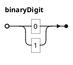


## All EBNF Elements

EBNF elements handled by PlantUML are described below.

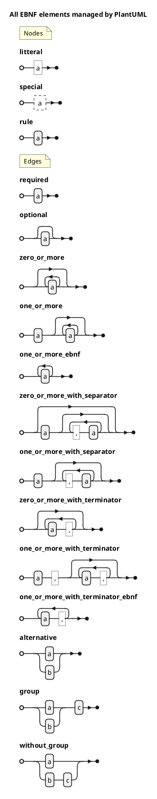


## Special sequence management with ``special-sequence-symbol "?"``

You can manage special sequence with ``special-sequence-symbol "?"``.

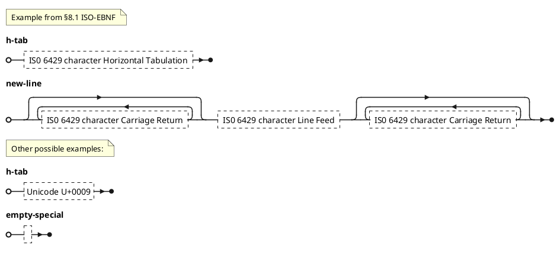

*[Ref. [QA-16781](https://forum.plantuml.net/16781/allow-special-sequence-management-special-sequence-symbol)]*


## Full repetition management with ``repetition-symbol "*"``

You can manage repetition with ``repetition-symbol "*"``.

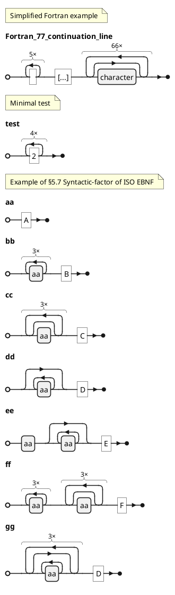

*[Ref. [QA-16750](https://forum.plantuml.net/16750/ebnf-allow-full-repetition-management-with-repetition-symbol)]*


## Drawing mode

Before version V1.2025.1, you can choice the drawing mode, and having a compacted mode by using `!pragma compact` command.

### Expanded mode _(by default, and the only one from V1.2025.1)_
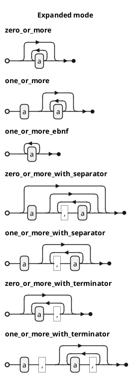

### Compacted mode _(only available before V1.2025.1)_
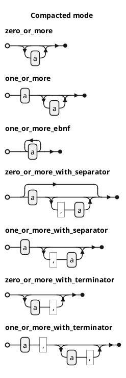


*[Ref. [QA-16692](https://forum.plantuml.net/16692/ebnf-theo-as-default), [QA-16529](https://forum.plantuml.net/16529/could-we-add-syntax-diagrams?show=16685#c16685)]*

*[End of the compacted mode: [GH-1585](https://github.com/plantuml/plantuml/issues/1585)]*


## Notes on Elements

Notes may be added to elements of your diagram by using EBNF comment tags.

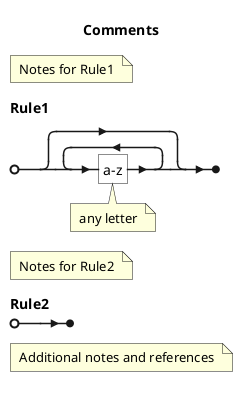


## Using (global) style

### Without style *(by default)*
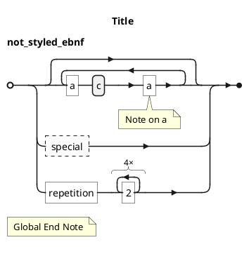


### With style

You can use [style](style-evolution) to change rendering of elements.

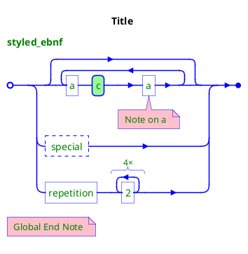

*[Ref. [QA-16529](https://forum.plantuml.net/16529/could-we-add-syntax-diagrams?show=16685#c16685)]*


## Example of LISP Grammar

LISP Grammar with PlantUML.

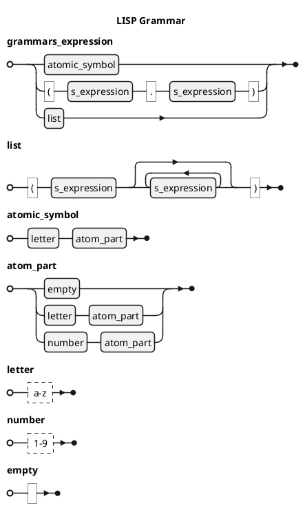

[Ref. ]


## EBNF of PlantUMLs EBNF Grammar

EBNF allows for self description, so here it is!

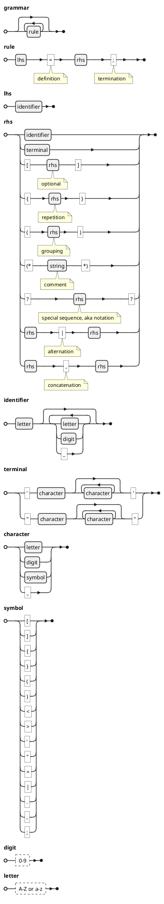


## Java Language Specification

A real world example of a detailed programming language.

### Packages and Modules
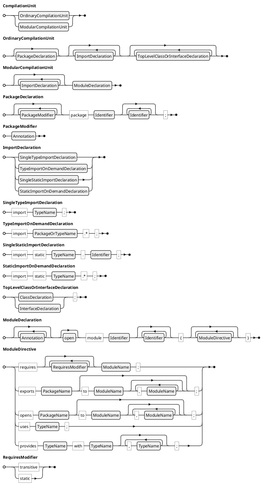

### Lexical Structure
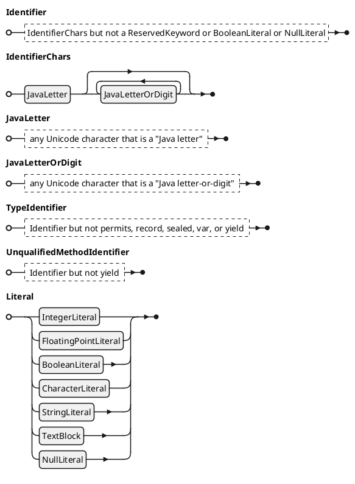

### Types, Values, and Variables
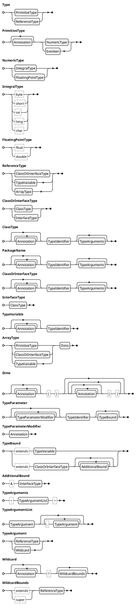

### Names
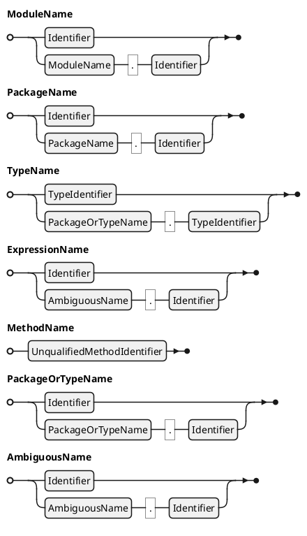

### Classes
```plantuml
@startebnf
ClassDeclaration = NormalClassDeclaration | EnumDeclaration | RecordDeclaration;
NormalClassDeclaration = {ClassModifier}, "class", TypeIdentifier, [TypeParameters], [ClassExtends], [ClassImplements], [ClassPermits], ClassBody;
ClassModifier = Annotation | "public" | "protected" | "private" | "abstract" | "static" | "final" | "sealed" | "non-sealed" | "strictfp";
TypeParameters = "<", TypeParameterList, ">";
TypeParameterList = TypeParameter, {",", TypeParameter};
ClassExtends = "extends", ClassType;
ClassImplements = "implements", InterfaceTypeList;
InterfaceTypeList = InterfaceType, {",", InterfaceType};
ClassPermits = "permits", TypeName, {",", TypeName};
ClassBody = "{", {ClassBodyDeclaration}, "}";
ClassBodyDeclaration = ClassMemberDeclaration | InstanceInitializer | StaticInitializer | ConstructorDeclaration;
ClassMemberDeclaration = (FieldDeclaration | MethodDeclaration | ClassDeclaration | InterfaceDeclaration), ";";
FieldDeclaration = {FieldModifier}, UnannType, VariableDeclaratorList, ";";
FieldModifier = Annotation | "public" | "protected" | "private" | "static" | "final" | "transient" | "volatile";
VariableDeclaratorList = VariableDeclarator, {",", VariableDeclarator};
VariableDeclarator = VariableDeclaratorId, ["=", VariableInitializer];
VariableDeclaratorId = Identifier, [Dims];
VariableInitializer = Expression | ArrayInitializer;
UnannType = UnannPrimitiveType | UnannReferenceType;
UnannPrimitiveType = NumericType | boolean;
UnannReferenceType = UnannClassOrInterfaceType | UnannTypeVariable | UnannArrayType;
UnannClassOrInterfaceType = UnannClassType | UnannInterfaceType;
UnannClassType = (TypeIdentifier, [TypeArguments]) | (PackageName, ".", {Annotation}, TypeIdentifier, [TypeArguments]) | (UnannClassOrInterfaceType, ".", {Annotation}, TypeIdentifier, [TypeArguments]) | (TypeIdentifier, [TypeArguments]) | (TypeIdentifier, [TypeArguments]);
UnannInterfaceType = UnannClassType;
UnannTypeVariable = TypeIdentifier;
UnannArrayType = (UnannPrimitiveType, Dims) | (UnannClassOrInterfaceType, Dims) | (UnannTypeVariable, Dims);
MethodDeclaration = {MethodModifier}, MethodHeader, MethodBody;
MethodModifier = Annotation | "public" | "protected" | "private" | "abstract" | "static" | "final" | "synchronized" | "native" | "strictfp";
MethodHeader = (Result, MethodDeclarator, [Throws]) | (TypeParameters, {Annotation}, Result, MethodDeclarator, [Throws]);
Result = UnannType | "void";
MethodDeclarator = Identifier, ( [ ReceiverParameter, "," ], [FormalParameterList] ), [Dims];
ReceiverParameter = {Annotation}, UnannType, [Identifier, "."], "this";
FormalParameterList = FormalParameter, {",", FormalParameter};
FormalParameter = ({VariableModifier}, UnannType, VariableDeclaratorId) | VariableArityParameter;
VariableArityParameter = {VariableModifier}, UnannType, {Annotation}, "...", Identifier;
VariableModifier = Annotation | "final";
Throws = "throws", ExceptionTypeList;
ExceptionTypeList = ExceptionType, {",", ExceptionType};
ExceptionType = ClassType | TypeVariable;
MethodBody = Block | ";";
InstanceInitializer = Block;
StaticInitializer = "static", Block;
ConstructorDeclaration = {ConstructorModifier}, ConstructorDeclarator, [Throws], ConstructorBody;
ConstructorModifier = Annotation | "public" | "protected" | "private";
ConstructorDeclarator = [TypeParameters], SimpleTypeName, ( [ReceiverParameter, ","], [FormalParameterList] );
SimpleTypeName = TypeIdentifier;
ConstructorBody = { [ExplicitConstructorInvocation], [BlockStatements] };
ExplicitConstructorInvocation = ( [TypeArguments], "this", "(", [ArgumentList], ")", ";" ) | ([TypeArguments], "super", "(", [ArgumentList], ")", ";" ) | (ExpressionName, ".", [TypeArguments], "super", "(", [ArgumentList], ")", ";" ) | (Primary, "." [TypeArguments], "super", "(" [ArgumentList], ")", ";";
EnumDeclaration = {ClassModifier}, "enum", TypeIdentifier, [ClassImplements], EnumBody;
EnumBody = "{", [EnumConstantList], [","], [EnumBodyDeclarations], "}";
EnumConstantList = EnumConstant, {",", EnumConstant};
EnumConstant = {EnumConstantModifier}, Identifier, ["(", [ArgumentList], ")"], [ClassBody];
EnumConstantModifier = Annotation;
EnumBodyDeclarations = ";", {ClassBodyDeclaration};
RecordDeclaration = {ClassModifier}, "record", TypeIdentifier, [TypeParameters], RecordHeader, [ClassImplements], RecordBody;
RecordHeader = "(", [RecordComponentList], ")";
RecordComponentList = RecordComponent, {",", RecordComponent};
RecordComponent = (RecordComponentModifier}, UnannType, Identifier) | VariableArityRecordComponent;
VariableArityRecordComponent = {RecordComponentModifier}, UnannType, {Annotation}, "...", Identifier;
RecordComponentModifier = Annotation;
RecordBody = "{", {RecordBodyDeclaration}, "}";
RecordBodyDeclaration = ClassBodyDeclaration | CompactConstructorDeclaration;
CompactConstructorDeclaration = {ConstructorModifier}, SimpleTypeName, ConstructorBody;
@endebnf
```

### Interfaces
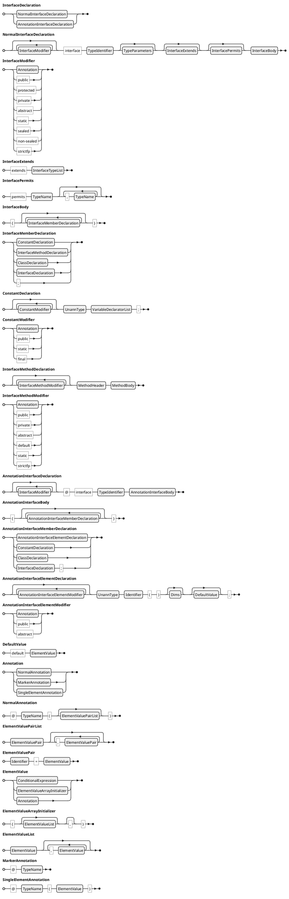

### Arrays
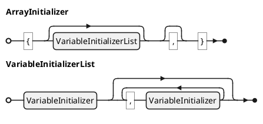

### Blocks, Statements, and Patterns
```plantuml
@startebnf
Block = "{", [BlockStatements], "}";
BlockStatements = BlockStatement, {BlockStatement};
BlockStatement = LocalClassOrInterfaceDeclaration | LocalVariableDeclarationStatement | Statement;
LocalClassOrInterfaceDeclaration = ClassDeclaration | NormalInterfaceDeclaration;
LocalVariableDeclarationStatement = LocalVariableDeclaration, ";";
LocalVariableDeclaration = {VariableModifier}, LocalVariableType, VariableDeclaratorList;
LocalVariableType = UnannType | "var";
Statement = StatementWithoutTrailingSubstatement | LabeledStatement | IfThenStatement | IfThenElseStatement | WhileStatement | ForStatement;
StatementNoShortIf = StatementWithoutTrailingSubstatement | LabeledStatementNoShortIf | IfThenElseStatementNoShortIf | WhileStatementNoShortIf | ForStatementNoShortIf;
StatementWithoutTrailingSubstatement = Block | EmptyStatement | ExpressionStatement | AssertStatement | SwitchStatement | DoStatement | BreakStatement | ContinueStatement | ReturnStatement | SynchronizedStatement | ThrowStatement | TryStatement | YieldStatement;
EmptyStatement = ";";
LabeledStatement = Identifier, ":", Statement;
LabeledStatementNoShortIf = Identifier, ":", StatementNoShortIf;
ExpressionStatement = StatementExpression, ";";
StatementExpression = Assignment | PreIncrementExpression | PreDecrementExpression | PostIncrementExpression | PostDecrementExpression | MethodInvocation | ClassInstanceCreationExpression;
IfThenStatement = "if", "(", Expression, ")", Statement;
IfThenElseStatement = "if", "(", Expression, ")", StatementNoShortIf, "else", Statement;
IfThenElseStatementNoShortIf = "if", "(", Expression, ")", StatementNoShortIf, "else", StatementNoShortIf;
AssertStatement = ("assert", Expression, ";") | ("assert", Expression, ":", Expression, ";");
SwitchStatement = "switch", "(", Expression, ")", SwitchBlock;
SwitchBlock = ( "{", SwitchRule, {SwitchRule}, "}" ) | ( "{", {SwitchBlockStatementGroup}, {SwitchLabel, ":"}, "}" );
SwitchRule = (SwitchLabel, "->", Expression, ";") |(SwitchLabel, "->", Block) | (SwitchLabel, "->", ThrowStatement);
SwitchBlockStatementGroup = SwitchLabel, ":", {SwitchLabel, ":"}, BlockStatements;
SwitchLabel = ("case", CaseConstant, {",", CaseConstant}) | "default";
CaseConstant = ConditionalExpression;
WhileStatement = "while", "(", Expression, ")", Statement;
WhileStatementNoShortIf = "while", "(", Expression, ")", StatementNoShortIf;
DoStatement = "do", Statement, "while", "(", Expression, ")", ";";
ForStatement = BasicForStatement | EnhancedForStatement | ForStatementNoShortIf | BasicForStatementNoShortIf | EnhancedForStatementNoShortIf;
BasicForStatement = "for", "(", [ForInit], ";", [Expression], ";", [ForUpdate], ")", Statement;
BasicForStatementNoShortIf = "for", "(", [ForInit], ";", [Expression], ";", [ForUpdate], ")", StatementNoShortIf;
ForInit = StatementExpressionList | LocalVariableDeclaration;
ForUpdate = StatementExpressionList;
StatementExpressionList = StatementExpression, {",", StatementExpression};
EnhancedForStatement = "for", "(", LocalVariableDeclaration, ":", Expression, ")", Statement;
EnhancedForStatementNoShortIf = "for", "(", LocalVariableDeclaration, ":", Expression, ")", StatementNoShortIf;
BreakStatement = break, [Identifier], ";";
YieldStatement = "yield", Expression, ";";
ContinueStatement = "continue", [Identifier], ";";
ReturnStatement = "return" [Expression], ";";
ThrowStatement = "throw", Expression, ";";
SynchronizedStatement = "synchronized", "(", Expression, ")", Block;
TryStatement = ("try", Block, Catches) | ("try", Block, [Catches], Finally ) | TryWithResourcesStatement;
Catches = CatchClause, {CatchClause};
CatchClause = "catch", "(", CatchFormalParameter, ")", Block;
CatchFormalParameter = {VariableModifier}, CatchType, VariableDeclaratorId;
CatchType = UnannClassType, {"|", ClassType};
Finally = "finally", Block;
TryWithResourcesStatement = "try", ResourceSpecification, Block, [Catches], [Finally];
ResourceSpecification = "(", ResourceList, [";"], ")";
ResourceList = Resource, {";", Resource};
Resource = LocalVariableDeclaration | VariableAccess;
Pattern = TypePattern;
TypePattern = LocalVariableDeclaration;

(* Expressions *)

Primary = PrimaryNoNewArray | ArrayCreationExpression;
PrimaryNoNewArray = Literal | ClassLiteral | "this" | (TypeName, ".", "this") | ( "(", Expression, ")" ) | ClassInstanceCreationExpression | FieldAccess | ArrayAccess | MethodInvocation | MethodReference;
ClassLiteral = (TypeName, { "[", "]" }, ".", "class") | (NumericType, {"[", "]"}, ".", "class") | ("boolean", {"[", "]"}, ".", "class") | ("void", ".", "class");
ClassInstanceCreationExpression = UnqualifiedClassInstanceCreationExpression | (ExpressionName, ".", UnqualifiedClassInstanceCreationExpression) |(Primary, ".", UnqualifiedClassInstanceCreationExpression);
UnqualifiedClassInstanceCreationExpression = "new", [TypeArguments], ClassOrInterfaceTypeToInstantiate, "(", [ArgumentList], ")", [ClassBody];
ClassOrInterfaceTypeToInstantiate = {Annotation}, Identifier, {".", {Annotation}, Identifier}, [TypeArgumentsOrDiamond];
TypeArgumentsOrDiamond = TypeArguments | ("<",">");
ArrayCreationExpression = ArrayCreationExpressionWithoutInitializer | ArrayCreationExpressionWithInitializer;
ArrayCreationExpressionWithoutInitializer = ("new", PrimitiveType, DimExprs, [Dims]) | ("new", ClassOrInterfaceType, DimExprs, [Dims]);
ArrayCreationExpressionWithInitializer = ("new", PrimitiveType, Dims, ArrayInitializer) | ("new", ClassOrInterfaceType, Dims, ArrayInitializer);
DimExprs = DimExpr, {DimExpr};
DimExpr = ({Annotation}, [ Expression ]) | (ArrayAccess, "=", ExpressionName, "[", Expression, "]") | (PrimaryNoNewArray, "[", Expression, "]") | (ArrayCreationExpressionWithInitializer, "[", Expression, "]");
FieldAccess = (Primary, ".", Identifier), ("super", ".", Identifier), (TypeName, ".", super, ".", Identifier);
MethodInvocation = (MethodName, "(", [ArgumentList], ")") | (TypeName, ".", [TypeArguments], Identifier, "(", [ArgumentList], ")") | (ExpressionName, ".", [TypeArguments], Identifier, "(", [ArgumentList], ")") | (Primary, ".", [TypeArguments], Identifier, "(", [ArgumentList], ")") | ("super", ".", [TypeArguments], Identifier, "(", [ArgumentList], ")") | (TypeName, ".", "super", ".", [TypeArguments], Identifier, "(", [ArgumentList], ")");
ArgumentList = Expression, {",", Expression};
MethodReference = (ExpressionName, "::", [TypeArguments], Identifier) | (Primary, "::", [TypeArguments], Identifier) | (ReferenceType, "::", [TypeArguments], Identifier) | ("super", "::", [TypeArguments], Identifier) | (TypeName, ".", super, "::", [TypeArguments], Identifier) | (ClassType, "::", [TypeArguments], "new") | (ArrayType, "::", "new");
Expression = LambdaExpression | AssignmentExpression;
LambdaExpression = LambdaParameters, "->", LambdaBody;
LambdaParameters = ("(", [LambdaParameterList], ")") | Identifier;
LambdaParameterList = (LambdaParameter, {",", LambdaParameter}) | (Identifier, {",", Identifier});
LambdaParameter = ({VariableModifier}, LambdaParameterType, VariableDeclaratorId) | VariableArityParameter;
LambdaParameterType = UnannType | "var";
LambdaBody = Expression | Block;
AssignmentExpression = ConditionalExpression | Assignment;
Assignment = LeftHandSide | AssignmentOperator | Expression;
LeftHandSide = ExpressionName | FieldAccess | ArrayAccess;
AssignmentOperator = "=" | "*=" | "/=" | "%=" | "+=" | "-=" | "<<=" | ">>=" | ">>>=" | "&=" | "^=" | "|=";
ConditionalExpression = ConditionalOrExpression | (ConditionalOrExpression, "?", Expression, ":", ConditionalExpression) | (ConditionalOrExpression, "?", Expression, ":", LambdaExpression);
ConditionalOrExpression = ConditionalAndExpression | (ConditionalOrExpression, "||", ConditionalAndExpression);
ConditionalAndExpression = InclusiveOrExpression | (ConditionalAndExpression, "&&", InclusiveOrExpression);
InclusiveOrExpression = ExclusiveOrExpression | (InclusiveOrExpression, "|", ExclusiveOrExpression);
ExclusiveOrExpression = AndExpression | (ExclusiveOrExpression, "^", AndExpression);
AndExpression = EqualityExpression, (AndExpression, "&", EqualityExpression) | (EqualityExpression, "=", RelationalExpression) | (EqualityExpression, "==", RelationalExpression) | (EqualityExpression, "!=", RelationalExpression);
RelationalExpression = ShiftExpression | (RelationalExpression, "<", ShiftExpression) | (RelationalExpression, ">", ShiftExpression) | (RelationalExpression, "<=", ShiftExpression) | (RelationalExpression, ">=", ShiftExpression) | (InstanceofExpression);
InstanceofExpression = (RelationalExpression, "instanceof", ReferenceType) | (RelationalExpression, "instanceof", Pattern);
ShiftExpression = AdditiveExpression | (ShiftExpression, "<<", AdditiveExpression) | (ShiftExpression, ">>", AdditiveExpression) | (ShiftExpression, ">>>", AdditiveExpression);
AdditiveExpression = MultiplicativeExpression | (AdditiveExpression, "+", MultiplicativeExpression) | (AdditiveExpression, "-", MultiplicativeExpression);
MultiplicativeExpression = UnaryExpression | (MultiplicativeExpression, "*", UnaryExpression) | (MultiplicativeExpression, "/", UnaryExpression) | (MultiplicativeExpression, "%", UnaryExpression);
UnaryExpression = PreIncrementExpression | PreDecrementExpression | ("+", UnaryExpression) | ("-", UnaryExpression) | UnaryExpressionNotPlusMinus;
PreIncrementExpression = "++", UnaryExpression;
PreDecrementExpression = "--", UnaryExpression;
UnaryExpressionNotPlusMinus = PostfixExpression | ("~", UnaryExpression) | ("!", UnaryExpression) | CastExpression | SwitchExpression;
PostfixExpression = Primary | ExpressionName | PostIncrementExpression | PostDecrementExpression;
PostIncrementExpression = PostfixExpression, "++";
PostDecrementExpression = PostfixExpression, "--";
CastExpression = ("(", PrimitiveType, ")", UnaryExpression) | ("(", ReferenceType, {AdditionalBound}, ")", UnaryExpressionNotPlusMinus) | ("(", ReferenceType, {AdditionalBound}, ")", LambdaExpression);
SwitchExpression = "switch", "(", Expression, ")", SwitchBlock;
ConstantExpression = Expression;
@endebnf
```


## Remaining defects

### Could you put 'arrow head' on all rerouted lines?

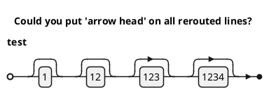

*Fixed by [EBNF more arrow head](https://github.com/plantuml/plantuml/commit/5bbb5a8d27e56db31aec97617edfbda6e3082703) on **V1.2024.8***

### Order issue

```plantuml
@startebnf
a = (one, two), three;
b = (one (* 1 *), two (* 2 *)), three (* 3 *);
@endebnf
```


*[Ref. [QA-17090](https://forum.plantuml.net/17090/ebnf-perserve-the-order-of-element), fixed by [EBNF concatenation order](https://github.com/plantuml/plantuml/commit/9521f6c06f6fa3af96c3d12ceb897c54fb97541a) on **V1.2024.8**]*

### Allow accentuated or Unicode char on EBNF meta-identifier or rule name.

```plantuml
@startebnf
(* Test of accentuated or Unicode char*)
alt = été | hiver;
hiver = 'froid';
été = 'chaud';
@endebnf
```
*[Ref. [QA-17145](https://forum.plantuml.net/17145/ebnf-allow-accentuated-unicode-char-ebnf-meta-identifier-rule) , fixed by [EBNF better unicode support](https://github.com/plantuml/plantuml/commit/99ea667a0c3b38fea848a208730d6776d668b5a6) on **V1.2024.8**]*

### Allow full restriction management with ``except-symbol "-"``

```plantuml
@startebnf
title First [modified] example of §5.8 Syntactic-term of ISO-EBNF

letter = ? "A" - "Z" ?;

vowel = "A" | "E" | "I" | "O" | "U";

consonant = letter - vowel;
@endebnf
```


*[Ref. [QA-16735](https://forum.plantuml.net/16735/ebnf-allow-full-restriction-management-with-except-symbol)]*

