# Entity Relationship Diagrams (Chen's notation)

This page is for Chen's [Entity Relationship](https://en.wikipedia.org/wiki/Entity%E2%80%93relationship_model) notation, which is commonly used in teaching. *See also [Information Engineering diagrams](ie-diagram).*

Entity Relationship (ER) diagrams are used to model databases at a conceptual level by describing entities, their attributes, and the relationships between them. In addition to basic relationships, PlantUML also supports subclasses and union types. This extended notation is sometimes referred to as Enhanced Entity Relationship (EER) or Extended Entity Relationship notation.

*[Ref. [GH-945](https://github.com/plantuml/plantuml/issues/945) and [GH-1718](https://github.com/plantuml/plantuml/pull/1718)]*

## Minimal Example

### Vertical _(by default)_
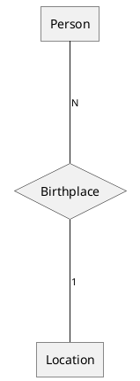

### Horizontal
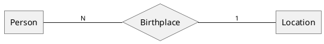

*[Ref. [PR-1740](https://github.com/plantuml/plantuml/pull/1740)]*

## Entities and attributes

*Entities* correspond to the "things" in your model. These can have *attributes* that describe them and those attributes can be *composite* (having nested attributes).

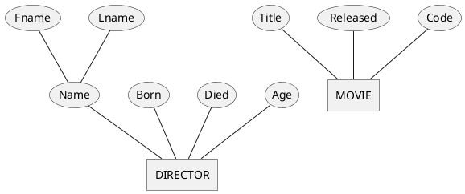

Attributes can be *keys*, meaning that their value is unique among entities of a given type, or they can be *derived*, meaning that their value is computed based on other attributes. Attributes may also be *multi-valued*, or have their *domain* (set of allowed values) defined.

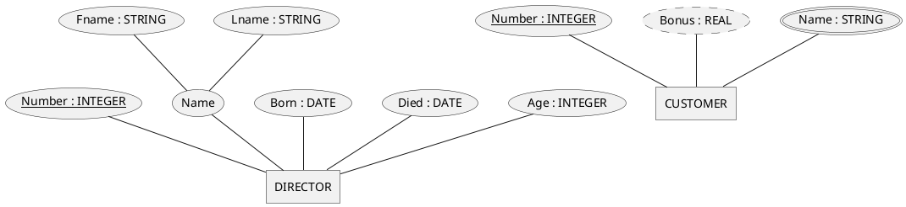

## Relationships

*Relationships* describe how entities are related to each other. These can be *one-to-one*, *one-to-many*, or *many-to-many*. They can have *total participation* (mandatory) or *partial participation* (optional). Total participation is indicated using a double or thicker line. Relationships can also have attributes.

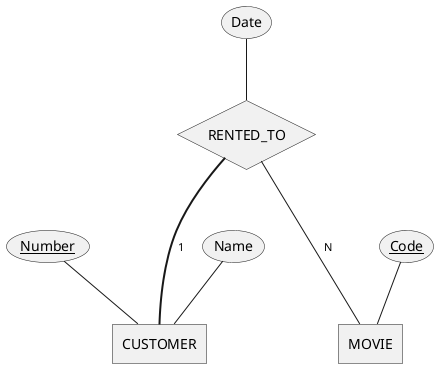

Relationships are not limited to two entities.

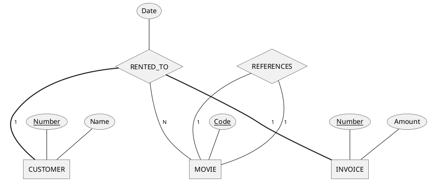

### Structural constraints

The cardinality of relationships can also be expressed as a range.

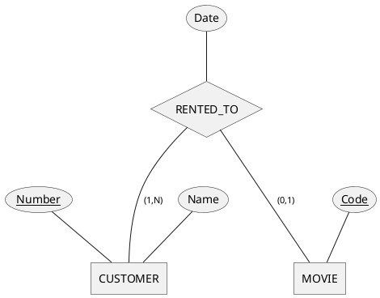

## Identifying relationships

A *weak* entity does not have a key attribute that uniquely identifies each instance of that entity. Instead, it is identified by the combination of a *partial key* on the weak entity itself and the key of another entity, which it is related to via an *identifying relationship*. A weak entity must have total participation in its identifying relationship.

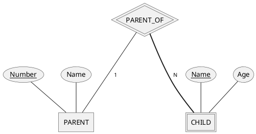

## Aliases

Entities, attributes and relationships can be given aliases to make the diagram more readable.

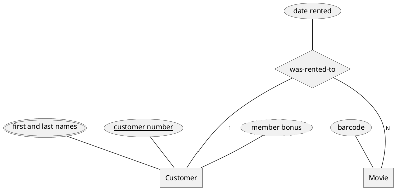

## Subclasses and categories

Entities can have *subclasses* and *superclasses*, much like in OOP, however a given subclass can have multiple superclasses. These are visually indicated using the subset symbol from set-theory.

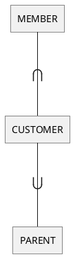

We can show how the different subclasses of a given entity are related by combining the associations. They can be either *disjoint* (one at a time) or *overlapping* (multiple at the same time).

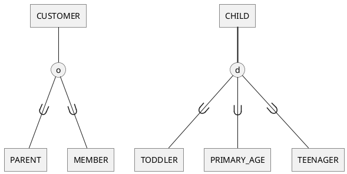

*Categories* or *union types* are similar to subclasses and can be used to group together multiple related entities.

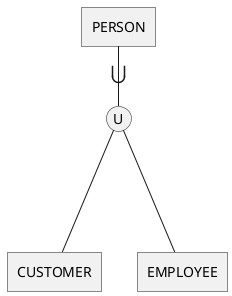

## Complex Example

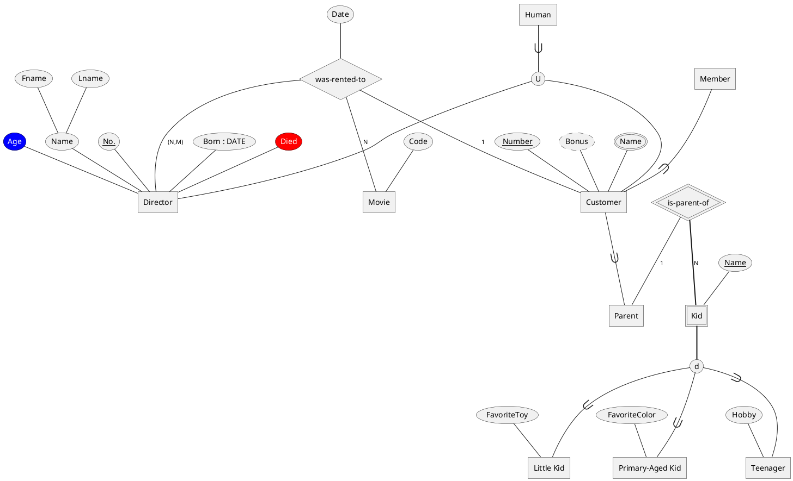

