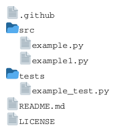
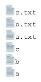
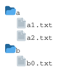
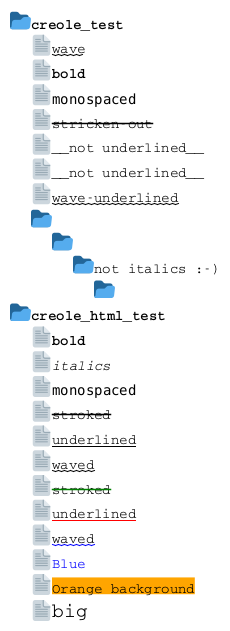
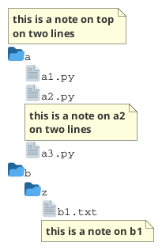

## Files tree diagram

You can use PlantUML to visualize directories and files tree.

To activate this feature, the diagram must:
* begin with ``@startfiles`` keyword
* end with ``@endfiles`` keyword.

*[Ref. [GH-1448](https://github.com/plantuml/plantuml/issues/1448)]*

## Order

The files are not sort and are on the same order as the source.

## Merge

The files are merged depending of there directory.

## Creole on Files tree

You can use [Creole or HTML Creole](creole) on Files tree:

## Using notes

You can use the ``<note>`` and  ``</note>`` keywords to define notes related to a single file.

*[Ref. [QA-18534](https://forum.plantuml.net/18534/note-invalid-position-in-directory-tree-listing)]*

