## Gantt Chart

A [Gantt Chart](https://en.wikipedia.org/wiki/Gantt_chart), is a powerful tool used for **project management**. It visually represents a **project schedule**, allowing managers and team members to see the start and end dates of the entire project at a glance. The diagram displays tasks or activities along a horizontal time axis, showing the **duration** of each task, their **sequence**, and how they overlap or run concurrently.

In a Gantt Chart, each task is represented by a bar, the length and position of which reflects the **start date**, **duration**, and **end date** of the task. This format makes it easy to understand **dependencies** between tasks, where one task must be completed before another can start. Additionally, Gantt Diagrams can include **milestones**, which are significant events or goals in the project timeline, marked as a distinct symbol.

In the context of creating Gantt Charts, **PlantUML** offers several advantages. It provides a **text-based approach** to diagram creation, making it easy to track changes using **version control systems**. This approach is particularly beneficial for teams who are already accustomed to text-based coding environments. PlantUML's syntax for Gantt Charts is **straightforward**, enabling quick modifications and updates to the project timeline. Additionally, the **integration of PlantUML with other tools** and its ability to generate diagrams dynamically from text makes it a versatile choice for teams looking to automate and streamline their project management documentation. The use of PlantUML for Gantt Charts thus combines the **clarity and efficiency** of visual project planning with the **flexibility and control** of a text-based system.


## Declaring tasks

The Gantt is described in *natural* language, using very simple sentences (subject-verb-complement).

Tasks defined using square bracket.

### Workload

The workload for each task is specified using the ``requires`` verb, indicating the amount of work needed in terms of days.


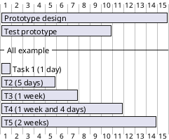

A week is typically understood as a span of seven days. However, in contexts where certain days are designated as 'closed' (like weekends), a week can be redefined in terms of 'non-closed' days. For example, if Saturday and Sunday are marked as closed, then a week in this context will equate to a five-day workload, corresponding to the remaining weekdays.

### Start

Their beginning are defined using the ``start`` verb:

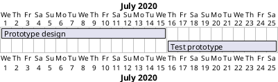
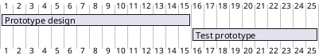

*[Ref. for ``D+nn`` form: [QA-14494](https://forum.plantuml.net/14494/is-it-possible-to-color-the-days-in-the-default-gantt-diagram?show=14550#c14550)]*

### End

Their ending are defined using the ``end`` verb:


### Start/End

It is possible to define both absolutely, by specifying dates:


## One-line declaration (with the and conjunction)

It is possible to combine declaration on one line with the ``and`` conjunction.


## Adding constraints
It is possible to add constraints between tasks.

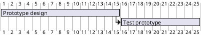

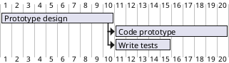


## Short names or alias
It is possible to define short name for tasks with the ``as`` keyword.


## Tasks with same name

_[Starting with V1.2024.6,]_ it is possible to have multiple tasks with same name.

```plantuml
@startgantt
Project starts 2020-11-08
[Task 7 days] as [T7] starts at 2020-11-09
[T7] ends at 2020-11-15
[Task 7 days] as [T7bis] starts at 2020-11-09
[T7bis] ends at 2020-11-15
@endgantt
```

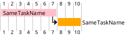

*[Ref. [QA-12176](https://forum.plantuml.net/12176) and [GH-1809](https://github.com/plantuml/plantuml/issues/1809)]*


## Customize colors
It is also possible to customize [colors](color) with ``is colored in``.

```plantuml
@startgantt
[Prototype design] requires 13 days
[Test prototype] requires 4 days
[Test prototype] starts at [Prototype design]'s end
[Prototype design] is colored in Fuchsia/FireBrick
[Test prototype] is colored in GreenYellow/Green
@endgantt
```


## Completion status
### Adding completion depending percentage
You can set the completion status of a task, by the command:
* ``is xx% completed``
* ``is xx% complete``

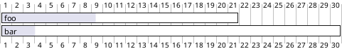

### Change colour of completion (by style)

```plantuml
@startgantt

<style>
ganttDiagram {
  task {
    BackGroundColor GreenYellow
    LineColor Green 
    unstarted {
      BackGroundColor Fuchsia 
      LineColor FireBrick
    }
  }
}
</style>

[Prototype design] requires 7 days
[Test prototype 0] requires 4 days
[Test prototype 10] requires 4 days
[Test prototype 20] requires 4 days
[Test prototype 30] requires 4 days
[Test prototype 40] requires 4 days
[Test prototype 50] requires 4 days
[Test prototype 60] requires 4 days
[Test prototype 70] requires 4 days
[Test prototype 80] requires 4 days
[Test prototype 90] requires 4 days
[Test prototype 100] requires 4 days

[Test prototype 0] starts at [Prototype design]'s end
[Test prototype 10] starts at [Prototype design]'s end
[Test prototype 20] starts at [Prototype design]'s end
[Test prototype 30] starts at [Prototype design]'s end
[Test prototype 40] starts at [Prototype design]'s end
[Test prototype 50] starts at [Prototype design]'s end
[Test prototype 60] starts at [Prototype design]'s end
[Test prototype 70] starts at [Prototype design]'s end
[Test prototype 80] starts at [Prototype design]'s end
[Test prototype 90] starts at [Prototype design]'s end
[Test prototype 100] starts at [Prototype design]'s end

[Test prototype 0] is 0% complete
[Test prototype 10] is 10% complete
[Test prototype 20] is 20% complete
[Test prototype 30] is 30% complete
[Test prototype 40] is 40% complete
[Test prototype 50] is 50% complete
[Test prototype 60] is 60% complete
[Test prototype 70] is 70% complete
[Test prototype 80] is 80% complete
[Test prototype 90] is 90% complete
[Test prototype 100] is 100% complete

@endgantt
```

*[Ref. [QA-8297](https://forum.plantuml.net/8297/plant-gantt-diagram-persentage-completed-determines-color?show=14324#c14324)]*

### Change colour of undone part of Task (by style)

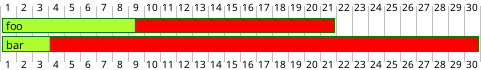

*[Ref. [QA-15299](https://forum.plantuml.net/15299/how-to-set-color-of-the-gantt-unstarted-task)]*


## Milestone
You can define Milestones using the ``happen`` verb.

### Relative milestone (use of constraints)
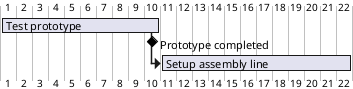

### Absolute milestone (use of fixed date)
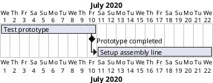


### Milestone of maximum end of tasks
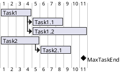
*[Ref. [QA-10764](https://forum.plantuml.net/10764/gantt-multiple-tasks-as-prerequisite-for-a-milestone)]*


## Hyperlinks
You can add hyperlinks to tasks.

```plantuml
@startgantt
[task1] requires 10 days
[task1] links to [[http://plantuml.com]]
@endgantt
```


## Calendar
You can specify a starting date for the whole project. By default, the first task starts at this date.

```plantuml
@startgantt
Project starts the 20th of september 2017
[Prototype design] as [TASK1] requires 13 days
[TASK1] is colored in Lavender/LightBlue
@endgantt
```


## Coloring days

It is possible to add [colors](color) to some days.

```plantuml
@startgantt
Project starts the 2020/09/01 

2020/09/07 is colored in salmon
2020/09/13 to 2020/09/16 are colored in lightblue

[Prototype design] as [TASK1] requires 22 days
[TASK1] is colored in Lavender/LightBlue
[Prototype completed] happens at [TASK1]'s end
@endgantt
```


## Changing scale
You can change scale for very long project, with one of those parameters:
* printscale
* ganttscale
* projectscale
  and one of the values:
* daily *(by default)*
* weekly
* monthly
* quarterly
* yearly

*(See [QA-11272](https://forum.plantuml.net/11272/gantt-keyword-printscale-should-replaced-with-projectscale?show=11274#a11274), [QA-9041](https://forum.plantuml.net/9041/gantt-improvement?show=10699#a10699) and [QA-10948](https://forum.plantuml.net/10948/gantt-printscale-weekly?show=10949#a10949))*

### Daily *(by default)*
```plantuml
@startgantt
saturday are closed
sunday are closed

Project starts the 1st of january 2021
[Prototype design end] as [TASK1] requires 19 days
[TASK1] is colored in Lavender/LightBlue
[Testing] requires 14 days
[TASK1]->[Testing]

2021-01-18 to 2021-01-22 are named [End's committee]
2021-01-18 to 2021-01-22 are colored in salmon
@endgantt
```

### Weekly
```plantuml
@startgantt
printscale weekly
saturday are closed
sunday are closed

Project starts the 1st of january 2021
[Prototype design end] as [TASK1] requires 19 days
[TASK1] is colored in Lavender/LightBlue
[Testing] requires 14 days
[TASK1]->[Testing]

2021-01-18 to 2021-01-22 are named [End's committee]
2021-01-18 to 2021-01-22 are colored in salmon
@endgantt
```

```plantuml
@startgantt
printscale weekly
Project starts the 20th of september 2020
[Prototype design] as [TASK1] requires 130 days
[TASK1] is colored in Lavender/LightBlue
[Testing] requires  20 days
[TASK1]->[Testing]

2021-01-18 to 2021-01-22 are named [End's committee]
2021-01-18 to 2021-01-22 are colored in salmon
@endgantt
```

### Monthly
```plantuml
@startgantt
projectscale monthly
Project starts the 20th of september 2020
[Prototype design] as [TASK1] requires 130 days
[TASK1] is colored in Lavender/LightBlue
[Testing] requires 20 days
[TASK1]->[Testing]

2021-01-18 to 2021-01-22 are named [End's committee]
2021-01-18 to 2021-01-22 are colored in salmon
@endgantt
```


### Quarterly
```plantuml
@startgantt
projectscale quarterly
Project starts the 20th of september 2020
[Prototype design] as [TASK1] requires 130 days
[TASK1] is colored in Lavender/LightBlue
[Testing] requires 20 days
[TASK1]->[Testing]

2021-01-18 to 2021-01-22 are named [End's committee]
2021-01-18 to 2021-01-22 are colored in salmon
@endgantt
```

```plantuml
@startgantt
projectscale quarterly
Project starts the 1st of october 2020
[Prototype design] as [TASK1] requires 700 days
[TASK1] is colored in Lavender/LightBlue
[Testing] requires 200 days
[TASK1]->[Testing]

2021-01-18 to 2021-03-22 are colored in salmon
@endgantt
```

### Yearly
```plantuml
@startgantt
projectscale yearly
Project starts the 1st of october 2020
[Prototype design] as [TASK1] requires 700 days
[TASK1] is colored in Lavender/LightBlue
[Testing] requires 200 days
[TASK1]->[Testing]

2021-01-18 to 2021-03-22 are colored in salmon
@endgantt
```

### Date range with between
#### Without date range
```plantuml
@startgantt
saturday are closed
sunday are closed

Project starts the 1st of january 2021
[Prototype design end] as [TASK1] requires 8 days
[TASK1] is colored in Lavender/LightBlue
[Testing] requires 3 days
[TASK1]->[Testing]

2021-01-18 to 2021-01-22 are named [End's committee]
2021-01-18 to 2021-01-22 are colored in salmon
@endgantt
```

#### With date range
```plantuml
@startgantt
Print between 2021-01-12 and 2021-01-22
Saturday are closed
sunday are closed

Project starts the 1st of january 2021
[Prototype design end] as [TASK1] requires 8 days
[TASK1] is colored in Lavender/LightBlue
[Testing] requires 3 days
[TASK1]->[Testing]

2021-01-18 to 2021-01-22 are named [End's committee]
2021-01-18 to 2021-01-22 are colored in salmon
@endgantt
```


## Zoom (example for all scale)

You can change zoom, with the parameter:
* ``zoom <integer>``

### Zoom on daily (default) scale
* Without zoom
  ```plantuml
  @startgantt
  printscale daily
  saturday are closed
  sunday are closed

Project starts the 1st of january 2021
[Prototype design end] as [TASK1] requires 8 days
[TASK1] is colored in Lavender/LightBlue
[Testing] requires  3 days
[TASK1]->[Testing]

2021-01-18 to 2021-01-22 are named [End's committee]
2021-01-18 to 2021-01-22 are colored in salmon
@endgantt
```

* With zoom
  ```plantuml
  @startgantt
  printscale daily zoom 2
  saturday are closed
  sunday are closed

Project starts the 1st of january 2021
[Prototype design end] as [TASK1] requires 8 days
[TASK1] is colored in Lavender/LightBlue
[Testing] requires 3 days
[TASK1]->[Testing]

2021-01-18 to 2021-01-22 are named [End's committee]
2021-01-18 to 2021-01-22 are colored in salmon
@endgantt
```
*[Ref. [QA-13725](https://forum.plantuml.net/13725/gantt-add-zoom-for-daily-scale)]*

### Zoom on weekly scale
* Without zoom
  ```plantuml
  @startgantt
  printscale weekly
  saturday are closed
  sunday are closed

Project starts the 1st of january 2021
[Prototype design end] as [TASK1] requires 19 days
[TASK1] is colored in Lavender/LightBlue
[Testing] requires 14 days
[TASK1]->[Testing]

2021-01-18 to 2021-01-22 are named [End's committee]
2021-01-18 to 2021-01-22 are colored in salmon
@endgantt
```

* With zoom
  ```plantuml
  @startgantt
  printscale weekly zoom 4
  saturday are closed
  sunday are closed

Project starts the 1st of january 2021
[Prototype design end] as [TASK1] requires 19 days
[TASK1] is colored in Lavender/LightBlue
[Testing] requires 14 days
[TASK1]->[Testing]

2021-01-18 to 2021-01-22 are named [End's committee]
2021-01-18 to 2021-01-22 are colored in salmon
@endgantt
```

### Zoom on monthly scale
* Without zoom
  ```plantuml
  @startgantt
  projectscale monthly
  Project starts the 20th of september 2020
  [Prototype design] as [TASK1] requires 130 days
  [TASK1] is colored in Lavender/LightBlue
  [Testing] requires 20 days
  [TASK1]->[Testing]

2021-01-18 to 2021-01-22 are named [End's committee]
2021-01-18 to 2021-01-22 are colored in salmon
@endgantt
```

* With zoom
  ```plantuml
  @startgantt
  projectscale monthly zoom 3
  Project starts the 20th of september 2020
  [Prototype design] as [TASK1] requires 130 days
  [TASK1] is colored in Lavender/LightBlue
  [Testing] requires 20 days
  [TASK1]->[Testing]

2021-01-18 to 2021-01-22 are named [End's committee]
2021-01-18 to 2021-01-22 are colored in salmon
@endgantt
```


### Zoom on quarterly scale
* Without zoom
  ```plantuml
  @startgantt
  projectscale quarterly
  Project starts the 20th of september 2020
  [Prototype design] as [TASK1] requires 130 days
  [TASK1] is colored in Lavender/LightBlue
  [Testing] requires 20 days
  [TASK1]->[Testing]

2021-01-18 to 2021-01-22 are named [End's committee]
2021-01-18 to 2021-01-22 are colored in salmon
@endgantt
```

* With zoom
  ```plantuml
  @startgantt
  projectscale quarterly zoom 7
  Project starts the 20th of september 2020
  [Prototype design] as [TASK1] requires 130 days
  [TASK1] is colored in Lavender/LightBlue
  [Testing] requires 20 days
  [TASK1]->[Testing]

2021-01-18 to 2021-01-22 are named [End's committee]
2021-01-18 to 2021-01-22 are colored in salmon
@endgantt
```

### Zoom on yearly scale
* Without zoom
  ```plantuml
  @startgantt
  projectscale yearly
  Project starts the 1st of october 2020
  [Prototype design] as [TASK1] requires 700 days
  [TASK1] is colored in Lavender/LightBlue
  [Testing] requires 200 days
  [TASK1]->[Testing]

2021-01-18 to 2021-03-22 are colored in salmon
@endgantt
```

* With zoom
  ```plantuml
  @startgantt
  projectscale yearly zoom 2
  Project starts the 1st of october 2020
  [Prototype design] as [TASK1] requires 700 days
  [TASK1] is colored in Lavender/LightBlue
  [Testing] requires 200 days
  [TASK1]->[Testing]

2021-01-18 to 2021-03-22 are colored in salmon
@endgantt
```


## Weekscale with Weeknumbers or Calendar Date

### With Weeknumbers *(by default)*
```plantuml
@startgantt
printscale weekly
Project starts the 6th of July 2020
[Task1] on {Alice} requires 2 weeks
[Task2] on {Bob:50%} requires 2 weeks
then [Task3] on {Alice:25%} requires 3 days
@endgantt
```

### With Weeknumbers *(starting from 1)*
```plantuml
@startgantt
printscale weekly with week numbering from 1
Project starts the 6th of July 2020
[Task1] on {Alice} requires 2 weeks
[Task2] on {Bob:50%} requires 2 weeks
then [Task3] on {Alice:25%} requires 3 days
@endgantt
```
*[Ref. [GH-525](https://github.com/plantuml/plantuml/issues/525)]*

### With specific Weeknumbers *(starting from n [including negative integer])*
```plantuml
@startgantt
printscale weekly with week numbering from 11
Project starts the 6th of July 2020
[Task1] on {Alice} requires 2 weeks
[Task2] on {Bob:50%} requires 2 weeks
then [Task3] on {Alice:25%} requires 3 days
@endgantt
```
```plantuml
@startgantt
printscale weekly with week numbering from -3
Project starts the 6th of July 2020
[Task1] on {Alice} requires 2 weeks
[Task2] on {Bob:50%} requires 2 weeks
then [Task3] on {Alice:25%} requires 3 days
@endgantt
```
*[Ref. [GH-2202](https://github.com/plantuml/plantuml/pull/2202)]*

###  With Calendar Date
```plantuml
@startgantt
printscale weekly with calendar date
Project starts the 6th of July 2020
[Task1] on {Alice} requires 2 weeks
[Task2] on {Bob:50%} requires 2 weeks
then [Task3] on {Alice:25%} requires 3 days
@endgantt
```

*[Ref. [QA-11630](https://forum.plantuml.net/11630/)]*


###  Change first day of week
```plantuml
@startgantt
printscale weekly
weeks starts on Sunday and must have at least 4 days
friday are closed
saturday are closed

Project starts the 1st of january 2025
[Prototype design end] as [TASK1] requires 19 days

[Testing] requires 14 days
[TASK1]->[Testing]

@endgantt
```

*[Ref. [QA-11630](https://forum.plantuml.net/11630/gantt-weekscale-with-weeknumbers?show=13586#a13586)]*


## Close day
It is possible to close some day.

```plantuml
@startgantt
project starts the 2018/04/09
saturday are closed
sunday are closed
2018/05/01 is closed
2018/04/17 to 2018/04/19 is closed
[Prototype design] requires 14 days
[Test prototype] requires 4 days
[Test prototype] starts at [Prototype design]'s end
[Prototype design] is colored in Fuchsia/FireBrick
[Test prototype] is colored in GreenYellow/Green
@endgantt
```


Then it is possible to open some closed day.

```plantuml
@startgantt
2020-07-07 to 2020-07-17 is closed
2020-07-13 is open

Project starts the 2020-07-01
[Prototype design] requires 10 days
Then [Test prototype] requires 10 days
@endgantt
```


## Definition of a week depending of closed days

A **week** is a synonym for how many non-closed days are in a week, as:
```plantuml
@startgantt
Project starts 2021-03-29
[Review 01] happens at 2021-03-29
[Review 02 - 3 weeks] happens on 3 weeks after [Review 01]'s end
[Review 02 - 21 days] happens on 21 days after [Review 01]'s end
@endgantt
```

So if you specify *Saturday* and *Sunday* as closed, a **week** will be equivalent to 5 days, as:
```plantuml
@startgantt
Project starts 2021-03-29
saturday are closed
sunday are closed
[Review 01] happens at 2021-03-29
[Review 02 - 3 weeks] happens on 3 weeks after [Review 01]'s end
[Review 02 - 21 days] happens on 21 days after [Review 01]'s end
@endgantt
```

*[Ref. [QA-13434](https://forum.plantuml.net/13434/gantt-milestone-bug?show=13449#c13449)]*


## Working days

It is possible to manage working days.

```plantuml
@startgantt

saturday are closed
sunday are closed
2022-07-04 to 2022-07-15 is closed

Project starts 2022-06-27
[task1] starts at 2022-06-27 and requires 1 week
[task2] starts 2 working days after [task1]'s end and requires 3 days

@endgantt
```

*[Ref. [QA-16188](https://forum.plantuml.net/16188/gantt-closed-days-arent-ignored-when-delaying-tasks?show=16395#a16395)]*


## Simplified task succession
It's possible to use the ``then`` keyword to denote consecutive tasks.

```plantuml
@startgantt
[Prototype design] requires 14 days
then [Test prototype] requires 4 days
then [Deploy prototype] requires 6 days
@endgantt
```

You can also use arrow ``->``


```plantuml
@startgantt
[Prototype design] requires 14 days
[Build prototype] requires 4 days
[Prepare test] requires 6 days
[Prototype design] -> [Build prototype]
[Prototype design] -> [Prepare test]
@endgantt
```


## Working with resources
You can affect tasks on resources using the ``on`` keyword and brackets for resource name.


```plantuml
@startgantt
[Task1] on {Alice} requires 10 days
[Task2] on {Bob:50%} requires 2 days
then [Task3] on {Alice:25%} requires 1 days
@endgantt
```

Multiple resources can be assigned to a task:


```plantuml
@startgantt
[Task1] on {Alice} {Bob} requires 20 days
@endgantt
```

Resources can be marked as off on specific days:

```plantuml
@startgantt
project starts on 2020-06-19
[Task1] on {Alice} requires 10 days
{Alice} is off on 2020-06-24 to 2020-06-26
@endgantt
```


## Hide resources

### Without any hiding (by default)

```plantuml
@startgantt
[Task1] on {Alice} requires 10 days
[Task2] on {Bob:50%} requires 2 days
then [Task3] on {Alice:25%} requires 1 days
then [Task4] on {Alice:25%} {Bob} requires 1 days
@endgantt
```


### Hide resources names

You can hide resources names and percentage, on tasks, using the ``hide resources names`` keywords.

```plantuml
@startgantt
hide resources names
[Task1] on {Alice} requires 10 days
[Task2] on {Bob:50%} requires 2 days
then [Task3] on {Alice:25%} requires 1 days
then [Task4] on {Alice:25%} {Bob} requires 1 days
@endgantt
```

### Hide resources footbox

You can also hide resources names on bottom of the diagram using the `` hide resources footbox`` keywords.

```plantuml
@startgantt
hide resources footbox
[Task1] on {Alice} requires 10 days
[Task2] on {Bob:50%} requires 2 days
then [Task3] on {Alice:25%} requires 1 days
then [Task4] on {Alice:25%} {Bob} requires 1 days
@endgantt
```

### Hide the both (resources names and resources footbox)

You can also hide the both.

```plantuml
@startgantt
hide resources names
hide resources footbox
[Task1] on {Alice} requires  10 days
[Task2] on {Bob:50%} requires 2 days
then [Task3] on {Alice:25%} requires 1 days
then [Task4] on {Alice:25%} {Bob} requires 1 days
@endgantt
```


## Horizontal Separator

You can use ``--`` to separate sets of tasks.

```plantuml
@startgantt
[Task1] requires 10 days
then [Task2] requires 4 days
-- Phase Two --
then [Task3] requires 5 days
then [Task4] requires 6 days
@endgantt
```


## Vertical Separator

You can add Vertical Separators with the syntax: ``Separator just [at]``.

```plantuml
@startgantt
[task1] requires 1 week
[task2] starts 20 days after [task1]'s end and requires 3 days

Separator just at [task1]'s end
Separator just 2 days after [task1]'s end

Separator just at [task2]'s start
Separator just 2 days before [task2]'s start
@endgantt
```

*[Ref. [QA-16247](https://forum.plantuml.net/16247/gantt-chart-vertical-separators)]*


## Complex example
It also possible to use the ``and`` conjunction.

You can also add delays in constraints.


```plantuml
@startgantt
[Prototype design] requires 13 days and is colored in Lavender/LightBlue
[Test prototype] requires 9 days and is colored in Coral/Green and starts 3 days after [Prototype design]'s end
[Write tests] requires 5 days and ends at [Prototype design]'s end
[Hire tests writers] requires 6 days and ends at [Write tests]'s start
[Init and write tests report] is colored in Coral/Green
[Init and write tests report] starts 1 day before [Test prototype]'s start and ends at [Test prototype]'s end
@endgantt
```


## Comments

As is mentioned on [Common Commands page](commons#560kta2oz3a2k362kjbm):
> Everything that starts with ``simple quote '`` is a comment.
>
> You can also put comments on several lines using ``/'`` to start and ``'/`` to end.
*(i.e.: the first character (except space character) of a comment line must be a ``simple quote '``)*


```plantuml
@startgantt
' This is a comment

[T1] requires 3 days

/' this comment
is on several lines '/

[T2] starts at [T1]'s end and requires 1 day
@endgantt
```


## Using style

### Without style (by default)
```plantuml
@startgantt
[Task1] requires 20 days
note bottom
  memo1 ...
  memo2 ...
  explanations1 ...
  explanations2 ...
end note
[Task2] requires 4 days
[Task1] -> [Task2]
-- Separator title --
[M1] happens on 5 days after [Task1]'s end
-- end --
@endgantt
```


### With style

You can use [style](style-evolution) to change rendering of elements.

```plantuml
@startgantt
<style>
ganttDiagram {
	task {
		FontName Helvetica
		FontColor red
		FontSize 18
		FontStyle bold
		BackGroundColor GreenYellow
		LineColor blue
	}
	milestone {
		FontColor blue
		FontSize 25
		FontStyle italic
		BackGroundColor yellow
		LineColor red
	}
	note {
		FontColor DarkGreen
		FontSize 10
		LineColor OrangeRed
	}
	arrow {
		FontName Helvetica
		FontColor red
		FontSize 18
		FontStyle bold
		BackGroundColor GreenYellow
		LineColor blue
	}
	separator {
		LineColor red
		BackGroundColor green
		FontSize 16
		FontStyle bold
		FontColor purple
	}
}
</style>
[Task1] requires 20 days
note bottom
  memo1 ...
  memo2 ...
  explanations1 ...
  explanations2 ...
end note
[Task2] requires 4 days
[Task1] -> [Task2]
-- Separator title --
[M1] happens on 5 days after [Task1]'s end
-- end --
@endgantt
```

*[Ref. [QA-10835](https://forum.plantuml.net/10835), [QA-12045](https://forum.plantuml.net/12045), [QA-11877](https://forum.plantuml.net/11877) and [PR-438](https://github.com/plantuml/plantuml/pull/438)]*

### With style (full example)

```plantuml
@startgantt
<style>
ganttDiagram {
	task {
		FontName Helvetica
		FontColor red
		FontSize 18
		FontStyle bold
		BackGroundColor GreenYellow
		LineColor blue
	}
	milestone {
		FontColor blue
		FontSize 25
		FontStyle italic
		BackGroundColor yellow
		LineColor red
	}
	note {
		FontColor DarkGreen
		FontSize 10
		LineColor OrangeRed
	}
	arrow {
		FontName Helvetica
		FontColor red
		FontSize 18
		FontStyle bold
		BackGroundColor GreenYellow
		LineColor blue
		LineStyle 8.0;13.0
		LineThickness 3.0
	}
	separator {
		BackgroundColor lightGreen
		LineStyle 8.0;3.0
		LineColor red
		LineThickness 1.0
		FontSize 16
		FontStyle bold
		FontColor purple
		Margin 5
		Padding 20
	}
	timeline {
	    BackgroundColor Bisque
	}
	closed {
		BackgroundColor pink
		FontColor red
	}
}
</style>
Project starts the 2020-12-01

[Task1] requires 10 days
sunday are closed

note bottom
memo1 ...
memo2 ...
explanations1 ...
explanations2 ...
end note

[Task2] requires 20 days
[Task2] starts 10 days after [Task1]'s end
-- Separator title --
[M1] happens on 5 days after [Task1]'s end

<style>
	separator {
	    LineColor black
		Margin 0
		Padding 0
	}
</style>

-- end --
@endgantt
```
*[Ref. [QA-13570](https://forum.plantuml.net/13570/can-you-style-the-days-and-months-of-a-gantt-chart?show=13589#a13589), [QA-13672](https://forum.plantuml.net/13672)]*

[[#00D700#DONE]]
*Thanks for style for Separator and all style for Arrow (thickness...)*

### Clean style

With style, you can also clean a Gantt diagram *(showing tasks, dependencies and relative durations only - but no actual start date and no actual scale)*:
```plantuml
@startgantt
<style>
ganttDiagram {
  timeline {
    LineColor transparent
    FontColor transparent
 }
}
</style>

hide footbox
[Test prototype] requires 7 days
[Prototype completed] happens at [Test prototype]'s end
[Setup assembly line] requires 9 days
[Setup assembly line] starts at [Test prototype]'s end
then [Setup] requires 5 days
[T2] requires 2 days and starts at [Test prototype]'s end
then [T3] requires 3 days
-- end task --
then [T4] requires 2 days
@endgantt
```
*[Ref. [QA-13971](https://forum.plantuml.net/13971)]*

Or:

```plantuml
@startgantt
<style>
ganttDiagram {
  timeline {
    LineColor transparent
    FontColor transparent
  }
  closed {
    FontColor transparent
  }
}
</style>

hide footbox
project starts the 2018/04/09
saturday are closed
sunday are closed
2018/05/01 is closed
2018/04/17 to 2018/04/19 is closed
[Prototype design] requires 9 days
[Test prototype] requires 5 days
[Test prototype] starts at [Prototype design]'s end
[Prototype design] is colored in Fuchsia/FireBrick
[Test prototype] is colored in GreenYellow/Green
@endgantt
```
*[Ref. [QA-13464](https://forum.plantuml.net/13464)]*


## Add notes

```plantuml
@startgantt
[task01] requires 15 days
note bottom
  memo1 ...
  memo2 ...
  explanations1 ...
  explanations2 ...
end note

[task01] -> [task02]

@endgantt
```

Example with overlap.
```plantuml
@startgantt
[task01] requires 15 days
note bottom
memo1 ...
memo2 ...
explanations1 ...
explanations2 ...
end note

[task01] -> [task02]
[task03] requires 5 days

@endgantt
```


```plantuml
@startgantt

-- test01 --

[task01] requires 4 days
note bottom
'note left
memo1 ...
memo2 ...
explanations1 ...
explanations2 ...
end note

[task02] requires 8 days
[task01] -> [task02]
note bottom
'note left
memo1 ...
memo2 ...
explanations1 ...
explanations2 ...
end note
-- test02 --

[task03] as [t3] requires 7 days
[t3] -> [t4]
@endgantt
```

[[#c0ffc0#DONE]]
*Thanks for correction (of [#386](https://github.com/plantuml/plantuml/issues/386) on [v1.2020.18](https://plantuml.com/changes)) when overlapping*

```plantuml
@startgantt

Project starts 2020-09-01

[taskA] starts 2020-09-01 and requires 3 days
[taskB] starts 2020-09-10 and requires 3 days
[taskB] displays on same row as [taskA]

[task01] starts 2020-09-05 and requires 4 days

then [task02] requires 8 days
note bottom
note for task02
more notes
end note

then [task03] requires 7 days
note bottom
note for task03
more notes
end note

-- separator --

[taskC] starts 2020-09-02 and requires 5 days
[taskD] starts 2020-09-09 and requires 5 days
[taskD] displays on same row as [taskC]

[task 10] starts 2020-09-05 and requires 5 days
then [task 11] requires 5 days
note bottom
note for task11
more notes
end note
@endgantt
```


## Pause tasks

```plantuml
@startgantt
Project starts the 5th of december 2018
saturday are closed
sunday are closed
2018/12/29 is opened
[Prototype design] requires 17 days
[Prototype design] pauses on 2018/12/13
[Prototype design] pauses on 2018/12/14
[Prototype design] pauses on monday
[Test prototype] starts at [Prototype design]'s end and requires 2 weeks
@endgantt
```


## Change link colors

You can change link colors:
* with this syntax: ``with <color> <style> link``
  ```plantuml
  @startgantt
  [T1] requires 4 days
  [T2] requires 4 days and starts 3 days after [T1]'s end with blue dotted link
  [T3] requires 4 days and starts 3 days after [T2]'s end with green bold link
  [T4] requires 4 days and starts 3 days after [T3]'s end with green dashed link
  @endgantt
  ```


* or directly by using arrow style

```plantuml
@startgantt
<style>
ganttDiagram {
	arrow {
		LineColor blue
	}
}
</style>
[Prototype design] requires 7 days
[Build prototype] requires 4 days
[Prepare test] requires 6 days
[Prototype design] -[#FF00FF]-> [Build prototype]
[Prototype design] -[dotted]-> [Prepare test]
Then [Run test]  requires 4 days
@endgantt
```

*[Ref. [QA-13693](https://forum.plantuml.net/13693)]*


## Tasks or Milestones on the same line

You can put Tasks or Milestones on the same line, with this syntax:
* `[T|M] displays on same row as [T|M]`

```plantuml
@startgantt
[Prototype design] requires 13 days
[Test prototype] requires 4 days and 1 week
[Test prototype] starts 1 week and 2 days after [Prototype design]'s end
[Test prototype] displays on same row as [Prototype design]
[r1] happens on 5 days after [Prototype design]'s end
[r2] happens on 5 days after [r1]'s end
[r3] happens on 5 days after [r2]'s end
[r2] displays on same row as [r1]
[r3] displays on same row as [r1]
@endgantt
```


## Highlight today

```plantuml
@startgantt
Project starts the 20th of september 2018
sunday are close
2018/09/21 to 2018/09/23 are colored in salmon
2018/09/21 to 2018/09/30 are named [Vacation in the Bahamas] 

today is 30 days after start and is colored in #AAF
[Foo] happens 40 days after start
[Dummy] requires 10 days and starts 10 days after start

@endgantt
```


## Task between two milestones

```plantuml
@startgantt
project starts on 2020-07-01
[P_start] happens 2020-07-03
[P_end]   happens 2020-07-13
[Prototype design] occurs from [P_start] to [P_end]
@endgantt
```


## Grammar and verbal form

| Verbal form  | Example |
| -----------  | ------- |
| [*T*] starts |                  |
| [*M*] happens |                  |


## Add title, header, footer, caption or legend

```plantuml
@startgantt

header some header

footer some footer

title My title

[Prototype design] requires 13 days

legend
The legend
end legend

caption This is caption

@endgantt
```

*(See also: [Common commands](commons))*


##  Add color on legend

```plantuml
@startgantt
[Kick off] requires 1 days and is colored in blue
then [Prototype design] requires 5 days
[Test prototype] requires 4 days
[Test prototype] starts at [Prototype design]'s end
[Prototype design] is colored in Green
[Test prototype] is colored in gray

legend
Legend:
|= Color |= Task Type |
|<#gray> | Planned |
|<#Green>| In progress |
|<#blue> | Done |
end legend

@endgantt
```

*[Ref. [QA-19021](https://forum.plantuml.net/19021/plant-uml-multiple-legend-in-gantt-view?show=19022#a19022)]*


## Removing Foot Boxes (example for all scale)

You can use the ``hide footbox`` keywords to remove the foot boxes
of the gantt diagram *(as for [sequence diagram](sequence-diagram))*.

Examples on:

* daily scale *(without project start)*
  ```plantuml
  @startgantt

hide footbox
title Foot Box removed

[Prototype design] requires 15 days
[Test prototype] requires 10 days
@endgantt
```

* daily scale
  ```plantuml
  @startgantt

Project starts the 20th of september 2017
[Prototype design] as [TASK1] requires 13 days
[TASK1] is colored in Lavender/LightBlue

hide footbox
@endgantt
```

* weekly scale
  ```plantuml
  @startgantt
  hide footbox

printscale weekly
saturday are closed
sunday are closed

Project starts the 1st of january 2021
[Prototype design end] as [TASK1] requires 19 days
[TASK1] is colored in Lavender/LightBlue
[Testing] requires 14 days
[TASK1]->[Testing]

2021-01-18 to 2021-01-22 are named [End's committee]
2021-01-18 to 2021-01-22 are colored in salmon
@endgantt
```


* monthly scale
  ```plantuml
  @startgantt

hide footbox

projectscale monthly
Project starts the 20th of september 2020
[Prototype design] as [TASK1] requires 130 days
[TASK1] is colored in Lavender/LightBlue
[Testing] requires 20 days
[TASK1]->[Testing]

2021-01-18 to 2021-01-22 are named [End's committee]
2021-01-18 to 2021-01-22 are colored in salmon
@endgantt
```

* quarterly scale
  ```plantuml
  @startgantt

hide footbox

projectscale quarterly
Project starts the 1st of october 2020
[Prototype design] as [TASK1] requires 700 days
[TASK1] is colored in Lavender/LightBlue
[Testing] requires 200 days
[TASK1]->[Testing]

2021-01-18 to 2021-03-22 are colored in salmon
@endgantt
```

* yearly scale
  ```plantuml
  @startgantt

hide footbox

projectscale yearly
Project starts the 1st of october 2020
[Prototype design] as [TASK1] requires 700 days
[TASK1] is colored in Lavender/LightBlue
[Testing] requires 200 days
[TASK1]->[Testing]

2021-01-18 to 2021-03-22 are colored in salmon
@endgantt
```


## Language of the calendar

You can choose the language of the Gantt calendar, with the ``language <xx>`` command where ``<xx>`` is the [ISO 639 code](https://en.wikipedia.org/wiki/List_of_ISO_639-1_codes) of the language.


### English  *(en, by default)*
```plantuml
@startgantt
saturday are closed
sunday are closed

Project starts 2021-01-01
[Prototype design end] as [TASK1] requires 19 days
[TASK1] is colored in Lavender/LightBlue
[Testing] requires 14 days
[TASK1]->[Testing]

2021-01-18 to 2021-01-22 are colored in salmon
@endgantt
```

### Deutsch (de)
```plantuml
@startgantt
language de
saturday are closed
sunday are closed

Project starts 2021-01-01
[Prototype design end] as [TASK1] requires 19 days
[TASK1] is colored in Lavender/LightBlue
[Testing] requires 14 days
[TASK1]->[Testing]

2021-01-18 to 2021-01-22 are colored in salmon
@endgantt
```

### Japanese (ja)
```plantuml
@startgantt
language ja
saturday are closed
sunday are closed

Project starts 2021-01-01
[Prototype design end] as [TASK1] requires 19 days
[TASK1] is colored in Lavender/LightBlue
[Testing] requires 14 days
[TASK1]->[Testing]

2021-01-18 to 2021-01-22 are colored in salmon
@endgantt
```

### Chinese (zh)
```plantuml
@startgantt
language zh
saturday are closed
sunday are closed

Project starts 2021-01-01
[Prototype design end] as [TASK1] requires 19 days
[TASK1] is colored in Lavender/LightBlue
[Testing] requires 14 days
[TASK1]->[Testing]

2021-01-18 to 2021-01-22 are colored in salmon
@endgantt
```

### Korean (ko)
```plantuml
@startgantt
language ko
saturday are closed
sunday are closed

Project starts 2021-01-01
[Prototype design end] as [TASK1] requires 19 days
[TASK1] is colored in Lavender/LightBlue
[Testing] requires 14 days
[TASK1]->[Testing]

2021-01-18 to 2021-01-22 are colored in salmon
@endgantt
```


## Delete Tasks or Milestones

You can mark some Tasks or Milestones as `deleted` instead of normally completed to distinguish tasks that may possibly have been discarded, postponed or whatever.

```plantuml
@startgantt
[Prototype design] requires 1 weeks
then [Prototype completed] requires 4 days
[End Prototype completed] happens at [Prototype completed]'s end
then [Test prototype] requires 5 days
[End Test prototype] happens at [Test prototype]'s end

[Prototype completed] is deleted
[End Prototype completed] is deleted
@endgantt
```

*[Ref. [QA-9129](https://forum.plantuml.net/9129)]*


## Start a project, a task or a milestone  a number of days before or after today

You can start a project, a task or a milestone a number of days before or after today, using the builtin functions ``%now`` and ``%date``:

```plantuml
@startgantt
title Today is %date("YYYY-MM-dd")
!$now = %now()
!$past = %date("YYYY-MM-dd", $now - 14*24*3600)
Project starts $past
today is colored in pink
[foo] requires 10 days
[bar] requires 5 days and starts %date("YYYY-MM-dd", $now + 4*24*3600)
[Tomorrow] happens %date("YYYY-MM-dd", $now + 1*24*3600)
@endgantt
```

*[Ref. [QA-16285](https://forum.plantuml.net/16285)]*


## Change Label position

### The labels are near elements *(by default)*
```plantuml
@startgantt
[Task1] requires 1 days
then [Task2_long_long_long] as [T2] requires 2 days
-- Phase Two --
then [Task3] as [T3] requires 2 days
[Task4] as [T4] requires 1 day
[Task5] as [T5] requires 2 days
[T2] -> [T4]
[T2] -> [T5]
[Task6_long_long_long] as [T6] requires 4 days
[T3] -> [T6]
[T5] -> [T6]
[End] happens 1 day after [T6]'s end
@endgantt
```

To change the label position, you can use the command ``label``:

```plantuml
@startebnf
label = "Label on", ('first'|'last'), " column" , ['and', ('left'|'right'), ' aligned'];
@endebnf
```

### Label on first column

* Left aligned
  ```plantuml
  @startgantt
  Label on first column and left aligned
  [Task1] requires 1 days
  then [Task2_long_long_long] as [T2] requires 2 days
  -- Phase Two --
  then [Task3] as [T3] requires 2 days
  [Task4] as [T4] requires 1 day
  [Task5] as [T5] requires 2 days
  [T2] -> [T4]
  [T2] -> [T5]
  [Task6_long_long_long] as [T6] requires 4 days
  [T3] -> [T6]
  [T5] -> [T6]
  [End] happens 1 day after [T6]'s end
  @endgantt
  ```

* Right aligned
  ```plantuml
  @startgantt
  Label on first column and right aligned
  [Task1] requires 1 days
  then [Task2_long_long_long] as [T2] requires 2 days
  -- Phase Two --
  then [Task3] as [T3] requires 2 days
  [Task4] as [T4] requires 1 day
  [Task5] as [T5] requires 2 days
  [T2] -> [T4]
  [T2] -> [T5]
  [Task6_long_long_long] as [T6] requires 4 days
  [T3] -> [T6]
  [T5] -> [T6]
  [End] happens 1 day after [T6]'s end
  @endgantt
  ```

### Label on last column
* Left aligned
  ```plantuml
  @startgantt
  Label on last column and left aligned
  [Task1] requires 1 days
  then [Task2_long_long_long] as [T2] requires 2 days
  -- Phase Two --
  then [Task3] as [T3] requires 2 days
  [Task4] as [T4] requires 1 day
  [Task5] as [T5] requires 2 days
  [T2] -> [T4]
  [T2] -> [T5]
  [Task6_long_long_long] as [T6] requires 4 days
  [T3] -> [T6]
  [T5] -> [T6]
  [End] happens 1 day after [T6]'s end
  @endgantt
  ```

* Right aligned
  ```plantuml
  @startgantt
  Label on last column and right aligned
  [Task1] requires 1 days
  then [Task2_long_long_long] as [T2] requires 2 days
  -- Phase Two --
  then [Task3] as [T3] requires 2 days
  [Task4] as [T4] requires 1 day
  [Task5] as [T5] requires 2 days
  [T2] -> [T4]
  [T2] -> [T5]
  [Task6_long_long_long] as [T6] requires 4 days
  [T3] -> [T6]
  [T5] -> [T6]
  [End] happens 1 day after [T6]'s end
  @endgantt
  ```

*[Ref. [QA-12433](https://forum.plantuml.net/12433/how-to-increase-width-of-day-in-gantt-diagram?show=13768#a13768)]*


## Definition of a month (30 days)

A **month** is a synonym for 30 days.
```plantuml
@startgantt
[A] lasts 2 days
[B] lasts 2 weeks
[C] lasts 1 month
@endgantt
```


*[Ref. [QA-14494](https://forum.plantuml.net/14494/is-it-possible-to-color-the-days-in-the-default-gantt-diagram?show=20277#c20277)]*

