## Common Commands in PlantUML

Discover the fundamental commands universally applicable across all diagram types in PlantUML. These commands allow you to inject versatility and personalized details into your diagrams. Below, we breakdown these common commands into three major categories:

### Global Elements
- **Comments:** Add remarks or explanatory notes in your diagram script to convey additional information or to leave reminders for further modifications.
- **Notes:** Incorporate supplementary information directly onto your diagram to aid in understanding or to highlight important aspects.
- **Size Control:** Adjust the dimensions of various elements to suit your preferences, ensuring a balanced and well-proportioned diagram.
- **Title and Captions:** Define a fitting title and add captions to elucidate the context or to annotate specific parts of your diagram.

### Creole Syntax Description
Harness [the power of Creole syntax](creole) to further format the content of any element within your diagram. This wiki markup style allows for:

- **Text Formatting:** Customize the appearance of your text with various styles and alignments.
- **Lists:** Create ordered or unordered lists to present information neatly.
- **Links:** Integrate hyperlinks to facilitate quick navigation to relevant resources.

### Style Control Command
Gain complete control over the [presentation style of your diagram elements](style-evolution) using the `style` command. Utilize this to:
- **Define Styles:** Set uniform styles for elements to maintain a cohesive visual theme.
- **Customize Colors:** Choose specific colors for various elements to enhance visual appeal and to create distinct classifications.

Explore these commands to create diagrams that are both functional and aesthetically pleasing, tailoring each element to your exact specifications.


## Comments

### Simple comment
Everything that starts with ``simple quote '`` at the beginning of a line is a comment.


```
@startuml
'Line comments use a single apostrophe
@enduml
```

### Block comment
Block comment use C-style comments except that instead of ``*`` you use an apostrophe ``'``, 
then you can also put comments on several lines using ``/'`` to start and ``'/`` to end.


```
@startuml
/'
many lines comments
here
'/
@enduml
```

*[Ref. [QA-1353](https://forum.plantuml.net/1353/is-it-possible-to-comment-out-lines-of-diagram-syntax?show=11808#a11808)]*

Then you can also put block comment on the same line, as:

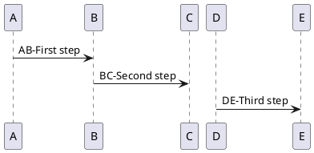

*[Ref. [QA-3906](https://forum.plantuml.net/3906/can-a-block-quote-begin-and-end-on-the-same-line) and [QA-3910](https://forum.plantuml.net/3910)]*

### Full example

```plantuml
@startuml
skinparam activity {
    ' this is a comment
    BackgroundColor White
    BorderColor Black /' this is a comment '/
    BorderColor Red  ' this is not a comment and this line is ignored
}

start
:foo1;
@enduml
```
*[Ref. [GH-214](https://github.com/plantuml/plantuml/issues/214)]*


## Zoom or Scale

You can use the ``scale`` command to zoom the generated image.

You can use either *a number* or *a fraction* to define the scale factor.
You can also specify either `width` or `height` (*in pixel*).
And you can also give both `width` and `height`: the image is scaled to fit inside the specified dimension.

* ``scale 1.5``
* ``scale 2/3``
* ``scale 200 width``
* ``scale 200 height``
* ``scale 200*100``
* ``scale max 300*200``
* ``scale max 1024 width``
* ``scale max 800 height``

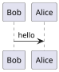


## Title
The ``title`` keywords is used to put a title.
You can add newline using ``\n`` in the title description.

Some skinparam settings are available to put borders on the title.
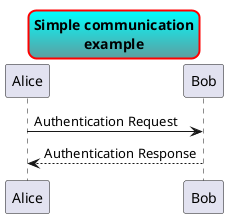

You can use [creole formatting](creole) in the title.

You can also define title on several lines using ``title``
and ``end title`` keywords.
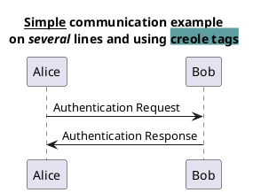


## Caption
There is also a ``caption`` keyword to put a caption under the diagram.
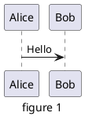


## Footer and header
You can use the commands ``header`` or ``footer`` to
add a footer or a header on any generated diagram.

You can optionally specify if you want a ``center``, ``left``
or ``right`` footer/header, by adding a keyword.

As with title, it is possible to define a header or a footer on
several lines.

It is also possible to put some HTML into the header or footer.
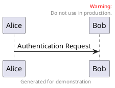


## Legend the diagram

The ``legend`` and ``end legend`` are keywords is used to put a legend.

You can optionally specify to have ``left``, ``right``, ``top``, ``bottom`` or ``center``
alignment for the legend.
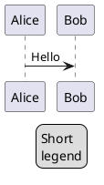

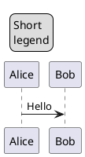


## Appendix: Examples on all diagram


### Activity

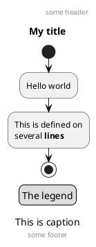

### Archimate

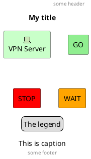

### Class

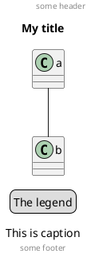

### Component, Deployment, Use-Case

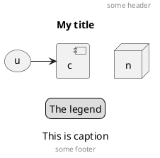

### Gantt project planning


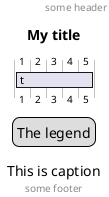

[[#98FB98#DONE]]
*[(Header, footer) corrected on [V1.2020.18](https://plantuml.com/changes)]*

### Object

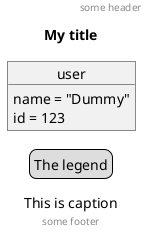

### MindMap

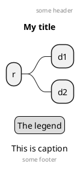

### Network (nwdiag)

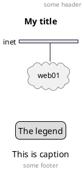

### Sequence

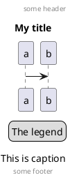

### State

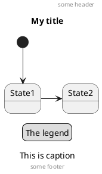

### Timing

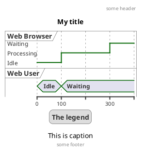

### Work Breakdown Structure (WBS)

```plantuml
@startwbs
header some header

footer some footer

title My title

caption This is caption

legend
The legend
end legend

* r
** d1
** d2

@endwbs
```

[[#98FB98#DONE]]
*[Corrected on [V1.2020.17](https://plantuml.com/changes)]*

### Wireframe (SALT)


```plantuml
@startsalt
header some header

footer some footer

title My title

caption This is caption

legend
The legend
end legend

{+
  Login    | "MyName   "
  Password | "****     "
  [Cancel] | [  OK   ]
}
@endsalt
```

[[#98FB98#DONE]]
*[Corrected on [V1.2020.18](https://plantuml.com/changes)]*


## Appendix: Examples on all diagram with style

[[#00CA00#DONE]]

FYI: 
* all is only good for **``Sequence diagram``**
* ``title``, ``caption`` and ``legend`` are good for all diagrams except for **``salt diagram``**
[[#FFD700#FIXME]] 🚩
* Now *(test on 1.2020.18-19)* ``header``, ``footer`` are not good for **all other diagrams** except only for **``Sequence diagram``**.
To be fix; Thanks

[[#FFD700#FIXME]]


Here are tests of ``title``, ``header``, ``footer``, ``caption`` or ``legend`` on all the diagram with the debug style:

```
<style>
title {
  HorizontalAlignment right
  FontSize 24
  FontColor blue
}

header {
  HorizontalAlignment center
  FontSize 26
  FontColor purple
}

footer {
  HorizontalAlignment left
  FontSize 28
  FontColor red
}

legend {
  FontSize 30
  BackGroundColor yellow
  Margin 30
  Padding 50
}

caption {
  FontSize 32
}
</style>
```

### Activity

```plantuml
@startuml
<style>
title {
  HorizontalAlignment right
  FontSize 24
  FontColor blue
}

header {
  HorizontalAlignment center
  FontSize 26
  FontColor purple
}

footer {
  HorizontalAlignment left
  FontSize 28
  FontColor red
}

legend {
  FontSize 30
  BackGroundColor yellow
  Margin 30
  Padding 50
}

caption {
  FontSize 32
}
</style>
header some header

footer some footer

title My title

caption This is caption

legend
The legend
end legend

start
:Hello world;
:This is defined on
several **lines**;
stop

@enduml
```

### Archimate

```plantuml
@startuml
<style>
title {
  HorizontalAlignment right
  FontSize 24
  FontColor blue
}

header {
  HorizontalAlignment center
  FontSize 26
  FontColor purple
}

footer {
  HorizontalAlignment left
  FontSize 28
  FontColor red
}

legend {
  FontSize 30
  BackGroundColor yellow
  Margin 30
  Padding 50
}

caption {
  FontSize 32
}
</style>
header some header

footer some footer

title My title

caption This is caption

legend
The legend
end legend

archimate #Technology "VPN Server" as vpnServerA <<technology-device>>

rectangle GO #lightgreen
rectangle STOP #red
rectangle WAIT #orange

@enduml
```

### Class

```plantuml
@startuml
<style>
title {
  HorizontalAlignment right
  FontSize 24
  FontColor blue
}

header {
  HorizontalAlignment center
  FontSize 26
  FontColor purple
}

footer {
  HorizontalAlignment left
  FontSize 28
  FontColor red
}

legend {
  FontSize 30
  BackGroundColor yellow
  Margin 30
  Padding 50
}

caption {
  FontSize 32
}
</style>
header some header

footer some footer

title My title

caption This is caption

legend
The legend
end legend

a -- b 

@enduml
```

### Component, Deployment, Use-Case

```plantuml
@startuml
<style>
title {
  HorizontalAlignment right
  FontSize 24
  FontColor blue
}

header {
  HorizontalAlignment center
  FontSize 26
  FontColor purple
}

footer {
  HorizontalAlignment left
  FontSize 28
  FontColor red
}

legend {
  FontSize 30
  BackGroundColor yellow
  Margin 30
  Padding 50
}

caption {
  FontSize 32
}
</style>
header some header

footer some footer

title My title

caption This is caption

legend
The legend
end legend

node n
(u) -> [c]

@enduml
```

### Gantt project planning

```plantuml
@startgantt
<style>
title {
  HorizontalAlignment right
  FontSize 24
  FontColor blue
}

header {
  HorizontalAlignment center
  FontSize 26
  FontColor purple
}

footer {
  HorizontalAlignment left
  FontSize 28
  FontColor red
}

legend {
  FontSize 30
  BackGroundColor yellow
  Margin 30
  Padding 50
}

caption {
  FontSize 32
}
</style>
header some header

footer some footer

title My title

caption This is caption

legend
The legend
end legend


[t] lasts 5 days

@endgantt
```


### Object

```plantuml
@startuml
<style>
title {
  HorizontalAlignment right
  FontSize 24
  FontColor blue
}

header {
  HorizontalAlignment center
  FontSize 26
  FontColor purple
}

footer {
  HorizontalAlignment left
  FontSize 28
  FontColor red
}

legend {
  FontSize 30
  BackGroundColor yellow
  Margin 30
  Padding 50
}

caption {
  FontSize 32
}
</style>
header some header

footer some footer

title My title

caption This is caption

legend
The legend
end legend

object user {
  name = "Dummy"
  id = 123
}

@enduml
```

### MindMap

```plantuml
@startmindmap
<style>
title {
  HorizontalAlignment right
  FontSize 24
  FontColor blue
}

header {
  HorizontalAlignment center
  FontSize 26
  FontColor purple
}

footer {
  HorizontalAlignment left
  FontSize 28
  FontColor red
}

legend {
  FontSize 30
  BackGroundColor yellow
  Margin 30
  Padding 50
}

caption {
  FontSize 32
}
</style>
header some header

footer some footer

title My title

caption This is caption

legend
The legend
end legend

* r
** d1
** d2

@endmindmap
```

### Network (nwdiag)

```plantuml
@startnwdiag
<style>
title {
  HorizontalAlignment right
  FontSize 24
  FontColor blue
}

header {
  HorizontalAlignment center
  FontSize 26
  FontColor purple
}

footer {
  HorizontalAlignment left
  FontSize 28
  FontColor red
}

legend {
  FontSize 30
  BackGroundColor yellow
  Margin 30
  Padding 50
}

caption {
  FontSize 32
}
</style>
header some header

footer some footer

title My title

caption This is caption

legend
The legend
end legend

nwdiag {
  network inet {
      web01 [shape = cloud]
  }
}

@endnwdiag
```

### Sequence

```plantuml
@startuml
<style>
title {
  HorizontalAlignment right
  FontSize 24
  FontColor blue
}

header {
  HorizontalAlignment center
  FontSize 26
  FontColor purple
}

footer {
  HorizontalAlignment left
  FontSize 28
  FontColor red
}

legend {
  FontSize 30
  BackGroundColor yellow
  Margin 30
  Padding 50
}

caption {
  FontSize 32
}
</style>
header some header

footer some footer

title My title

caption This is caption

legend
The legend
end legend

a->b
@enduml
```

### State

```plantuml
@startuml
<style>
title {
  HorizontalAlignment right
  FontSize 24
  FontColor blue
}

header {
  HorizontalAlignment center
  FontSize 26
  FontColor purple
}

footer {
  HorizontalAlignment left
  FontSize 28
  FontColor red
}

legend {
  FontSize 30
  BackGroundColor yellow
  Margin 30
  Padding 50
}

caption {
  FontSize 32
}
</style>
header some header

footer some footer

title My title

caption This is caption

legend
The legend
end legend

[*] --> State1
State1 -> State2

@enduml
```

### Timing

```plantuml
@startuml
<style>
title {
  HorizontalAlignment right
  FontSize 24
  FontColor blue
}

header {
  HorizontalAlignment center
  FontSize 26
  FontColor purple
}

footer {
  HorizontalAlignment left
  FontSize 28
  FontColor red
}

legend {
  FontSize 30
  BackGroundColor yellow
  Margin 30
  Padding 50
}

caption {
  FontSize 32
}
</style>
header some header

footer some footer

title My title

caption This is caption

legend
The legend
end legend

robust "Web Browser" as WB
concise "Web User" as WU

@0
WU is Idle
WB is Idle

@100
WU is Waiting
WB is Processing

@300
WB is Waiting

@enduml
```

### Work Breakdown Structure (WBS)

```plantuml
@startwbs
<style>
title {
  HorizontalAlignment right
  FontSize 24
  FontColor blue
}

header {
  HorizontalAlignment center
  FontSize 26
  FontColor purple
}

footer {
  HorizontalAlignment left
  FontSize 28
  FontColor red
}

legend {
  FontSize 30
  BackGroundColor yellow
  Margin 30
  Padding 50
}

caption {
  FontSize 32
}
</style>
header some header

footer some footer

title My title

caption This is caption

legend
The legend
end legend

* r
** d1
** d2

@endwbs
```


### Wireframe (SALT)

[[#FFD700#FIXME]] 
Fix all **(``title``, ``caption``, ``legend``, ``header``, ``footer``)** for salt.
[[#FFD700#FIXME]] 

```plantuml
@startsalt
<style>
title {
  HorizontalAlignment right
  FontSize 24
  FontColor blue
}

header {
  HorizontalAlignment center
  FontSize 26
  FontColor purple
}

footer {
  HorizontalAlignment left
  FontSize 28
  FontColor red
}

legend {
  FontSize 30
  BackGroundColor yellow
  Margin 30
  Padding 50
}

caption {
  FontSize 32
}
</style>
@startsalt
header some header

footer some footer

title My title

caption This is caption

legend
The legend
end legend

{+
  Login    | "MyName   "
  Password | "****     "
  [Cancel] | [  OK   ]
}
@endsalt
```


## Mainframe

```plantuml
@startuml
mainframe This is a **mainframe**
Alice->Bob : Hello
@enduml
```

*[Ref. [QA-4019](https://forum.plantuml.net/4019) and [Issue#148](https://github.com/plantuml/plantuml/issues/148)]*


## Appendix: Examples of Mainframe on all diagram
### Activity
```plantuml
@startuml
mainframe This is a **mainframe**

start
:Hello world;
:This is defined on
several **lines**;
stop
@enduml
```

### Archimate
```plantuml
@startuml
mainframe This is a **mainframe**

archimate #Technology "VPN Server" as vpnServerA <<technology-device>>
rectangle GO #lightgreen
rectangle STOP #red
rectangle WAIT #orange
@enduml
```

[[#FFD700#FIXME]] 🚩
Cropped on the top and on the left
[[#FFD700#FIXME]]

### Class
```plantuml
@startuml
mainframe This is a **mainframe**

a -- b 
@enduml
```

[[#FFD700#FIXME]] 🚩
Cropped on the top and on the left
[[#FFD700#FIXME]]

### Component, Deployment, Use-Case
```plantuml
@startuml
mainframe This is a **mainframe**

node n
(u) -> [c]
@enduml
```

[[#FFD700#FIXME]] 🚩
Cropped on the top and on the left
[[#FFD700#FIXME]]

### Gantt project planning

```plantuml
@startgantt
mainframe This is a **mainframe**

[t] lasts 5 days
@endgantt
```

[[#FFD700#FIXME]] 🚩
Cropped on the top and on the left
[[#FFD700#FIXME]]

### Object
```plantuml
@startuml
mainframe This is a **mainframe**

object user {
  name = "Dummy"
  id = 123
}
@enduml
```

[[#FFD700#FIXME]] 🚩
Cropped on the top!
[[#FFD700#FIXME]]

### MindMap
```plantuml
@startmindmap
mainframe This is a **mainframe**

* r
** d1
** d2
@endmindmap
```

### Network (nwdiag)
```plantuml
@startnwdiag
mainframe This is a **mainframe**

nwdiag {
  network inet {
      web01 [shape = cloud]
  }
}
@endnwdiag
```

[[#FFD700#FIXME]] 🚩
Cropped on the top!
[[#FFD700#FIXME]]

### Sequence
```plantuml
@startuml
mainframe This is a **mainframe**

a->b
@enduml
```

### State
```plantuml
@startuml
mainframe This is a **mainframe**

[*] --> State1
State1 -> State2
@enduml
```

[[#FFD700#FIXME]] 🚩
Cropped on the top and on the left
[[#FFD700#FIXME]]

### Timing
```plantuml
@startuml
mainframe This is a **mainframe**

robust "Web Browser" as WB
concise "Web User" as WU
@0
WU is Idle
WB is Idle
@100
WU is Waiting
WB is Processing
@300
WB is Waiting
@enduml
```

### Work Breakdown Structure (WBS)
```plantuml
@startwbs
mainframe This is a **mainframe**
* r
** d1
** d2
@endwbs
```

### Wireframe (SALT)
```plantuml
@startsalt
mainframe This is a **mainframe**
{+
  Login    | "MyName   "
  Password | "****     "
  [Cancel] | [  OK   ]
}
@endsalt
```


## Appendix: Examples of title, header, footer, caption, legend and mainframe on all diagram

### Activity

```plantuml
@startuml
mainframe This is a **mainframe**
header some header

footer some footer

title My title

caption This is caption

legend
The legend
end legend

start
:Hello world;
:This is defined on
several **lines**;
stop

@enduml
```

### Archimate

```plantuml
@startuml
mainframe This is a **mainframe**
header some header

footer some footer

title My title

caption This is caption

legend
The legend
end legend

archimate #Technology "VPN Server" as vpnServerA <<technology-device>>

rectangle GO #lightgreen
rectangle STOP #red
rectangle WAIT #orange

@enduml
```

### Class

```plantuml
@startuml
mainframe This is a **mainframe**
header some header

footer some footer

title My title

caption This is caption

legend
The legend
end legend

a -- b 

@enduml
```

### Component, Deployment, Use-Case

```plantuml
@startuml
mainframe This is a **mainframe**
header some header

footer some footer

title My title

caption This is caption

legend
The legend
end legend

node n
(u) -> [c]

@enduml
```

### Gantt project planning

```plantuml
@startgantt
mainframe This is a **mainframe**
header some header

footer some footer

title My title

caption This is caption

legend
The legend
end legend


[t] lasts 5 days

@endgantt
```

### Object

```plantuml
@startuml
mainframe This is a **mainframe**
header some header

footer some footer

title My title

caption This is caption

legend
The legend
end legend

object user {
  name = "Dummy"
  id = 123
}

@enduml
```

### MindMap

```plantuml
@startmindmap
mainframe This is a **mainframe**
header some header

footer some footer

title My title

caption This is caption

legend
The legend
end legend

* r
** d1
** d2

@endmindmap
```

### Network (nwdiag)

```plantuml
@startnwdiag
mainframe This is a **mainframe**
header some header

footer some footer

title My title

caption This is caption

legend
The legend
end legend

nwdiag {
  network inet {
      web01 [shape = cloud]
  }
}

@endnwdiag
```

### Sequence

```plantuml
@startuml
mainframe This is a **mainframe**
header some header

footer some footer

title My title

caption This is caption

legend
The legend
end legend

a->b
@enduml
```

### State

```plantuml
@startuml
mainframe This is a **mainframe**
header some header

footer some footer

title My title

caption This is caption

legend
The legend
end legend

[*] --> State1
State1 -> State2

@enduml
```

### Timing

```plantuml
@startuml
mainframe This is a **mainframe**
header some header

footer some footer

title My title

caption This is caption

legend
The legend
end legend

robust "Web Browser" as WB
concise "Web User" as WU

@0
WU is Idle
WB is Idle

@100
WU is Waiting
WB is Processing

@300
WB is Waiting

@enduml
```

### Work Breakdown Structure (WBS)

```plantuml
@startwbs
mainframe This is a **mainframe**
header some header

footer some footer

title My title

caption This is caption

legend
The legend
end legend

* r
** d1
** d2

@endwbs
```


### Wireframe (SALT)

```plantuml
@startsalt
mainframe This is a **mainframe**
header some header

footer some footer

title My title

caption This is caption

legend
The legend
end legend

{+
  Login    | "MyName   "
  Password | "****     "
  [Cancel] | [  OK   ]
}
@endsalt
```


