## Creole

[Creole](http://en.wikipedia.org/wiki/Creole_%28markup%29) is a lightweight common markup language for various wikis. 
A light-weight Creole engine is integrated in PlantUML to have a standardized way to emit styled text.

All diagrams support this syntax.

Note that compatibility with HTML syntax is preserved.


## Emphasized text

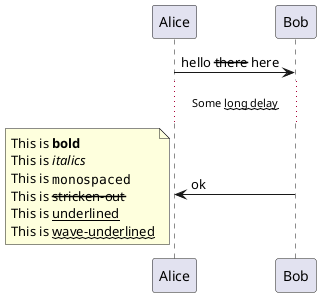


## Lists

You can use numbered and bulleted lists in node text, notes, etc.

[[#FFD700#FIXME]] 🚩 You cannot quite mix numbers and bullets in a list and its sublist.

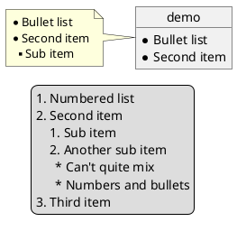


## Escape character

You can use the tilde ``~`` to escape special creole characters.
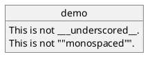


## Headings


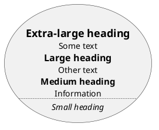


## Emoji

All emojis from [Twemoji](https://twemoji.twitter.com/) (see [EmojiTwo](https://github.com/EmojiTwo/emojitwo) on Github) are available using the following syntax:

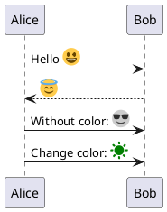

Unlike [Unicode Special characters](https://plantuml.com/creole#5d5a654fa7b639a4) that depend on installed fonts, the emoji are always available. Furthermore, emoji are already colored, but you can recolor them if you like (see examples above).

One can pick emoji from the [emoji cheat sheet](https://github.com/ikatyang/emoji-cheat-sheet/blob/master/README.md), the [Unicode full-emoji-list](https://unicode.org/emoji/charts/full-emoji-list.html), or the flat list [emoji.txt](https://github.com/plantuml/plantuml/blob/master/src/net/sourceforge/plantuml/emoji/data/emoji.txt) in the plantuml source.

You can also use the following PlantUML command to list available emoji:

```
@startuml
emoji <block>
@enduml
```

As of 13 April 2023, you can select between 1174 emoji from the following [Unicode blocks](https://en.wikipedia.org/wiki/Unicode_block):

* [Unicode block 26](https://www.plantuml.com/plantuml/svg/SoWkIImgAStDuKhDpS_AL30out98pKi12W00): 83 emoji
* [Unicode block 27](https://www.plantuml.com/plantuml/svg/SoWkIImgAStDuKhDpS_AL30ovt98pKi12W00): 33 emoji
* [Unicode block 1F3](https://www.plantuml.com/plantuml/svg/SoWkIImgAStDuKhDpS_AL31qC-PoICrB0Oe00000): 246 emoji
* [Unicode block 1F4](https://www.plantuml.com/plantuml/svg/SoWkIImgAStDuKhDpS_AL31qC-5oICrB0Oe00000): 255 emoji
* [Unicode block 1F5](https://www.plantuml.com/plantuml/svg/SoWkIImgAStDuKhDpS_AL31qC-LoICrB0Oe00000): 136 emoji
* [Unicode block 1F6](https://www.plantuml.com/plantuml/svg/SoWkIImgAStDuKhDpS_AL31qC-DoICrB0Oe00000): 181 emoji
* [Unicode block 1F9](https://www.plantuml.com/plantuml/svg/SoWkIImgAStDuKhDpS_AL31qi-HoICrB0Oe00000): 240 emoji

### Unicode block 26

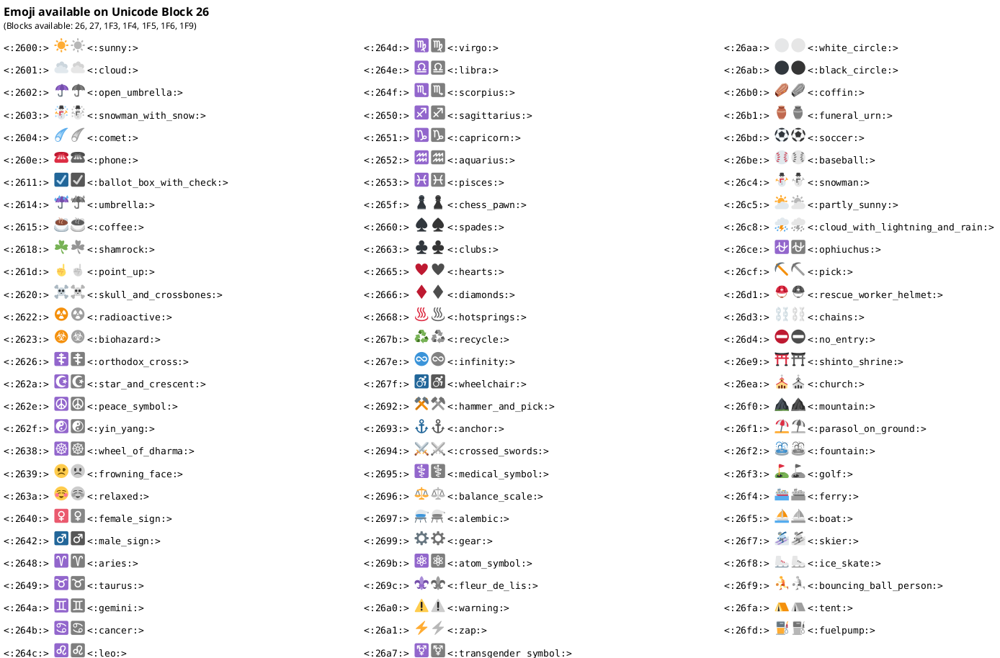


## Horizontal lines


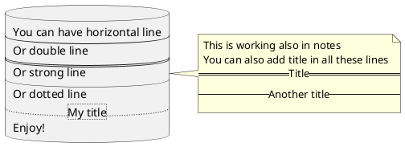


## Links

You can also [use URL and links](link).

Simple links are define using two square brackets (or three square brackets for field or method on class diagram).

__Example__:
* ``[[http://plantuml.com]]``
* ``[[http://plantuml.com This label is printed]]``
* ``[[http://plantuml.com{Optional tooltip} This label is printed]]``

URL can also be [authenticated](url-authentication).


## Code

You can use ``<code>`` to display some programming code in your diagram 
(sorry, syntax highlighting is not yet supported).

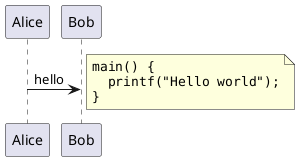

This is especially useful to illustrate some PlantUML code and the resulting rendering:

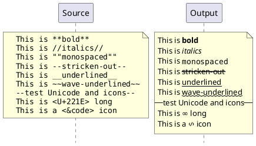


## Table

### Create a table
It is possible to build table, with `|` separator.

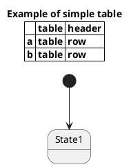

### Align fields using Table
You can use a table to align "fields" of class members. The example below (taken from [buildingSmart Data Dictionary](https://bsdd.ontotext.com/) shows for each member: icon, name, datatype and cardinality. Use the ``<#transparent,#transparent>`` color specification so table cells have no foreground and background color.

(The example also shows the use of icons)

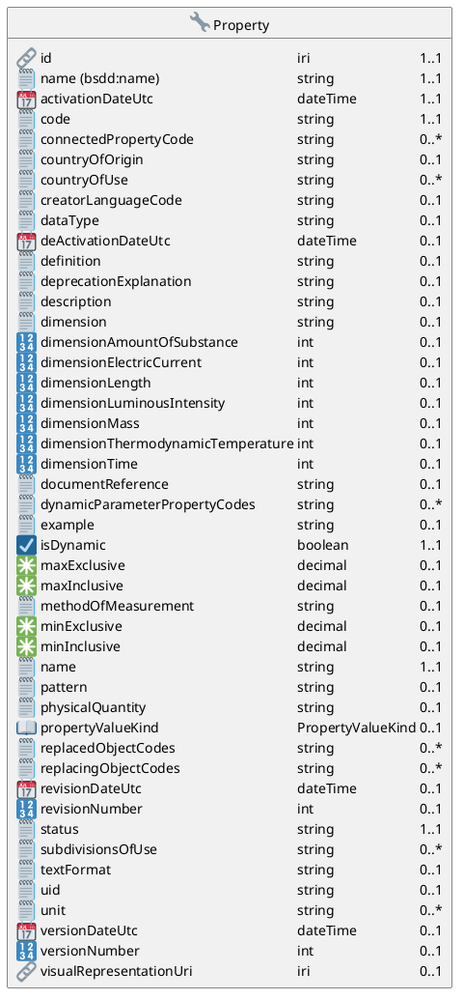

You can also try to use tabs ``\t`` and ``skinparam tabSize n`` to align fields, but this doesn't work so well: *[Ref. [QA-3820](https://forum.plantuml.net/3820)]*

### Add color on rows or cells
You can specify background [colors](color) of rows and cells:

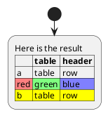

### Add color on border and text
You can also specify [colors](color) of text and borders.

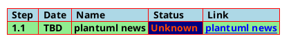

*[Ref. [QA-7184](https://forum.plantuml.net/7184)]*

### No border or same color as the background 
You can also set the border color to the same color as the background.

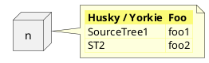
*[Ref. [QA-12448](https://forum.plantuml.net/12448/removing-hiding-borders-on-tables?show=12449#a12449)]*

### Bold header or not
`=` as the first char of a cell indicates whether to make it bold (usually used for headers), or not.
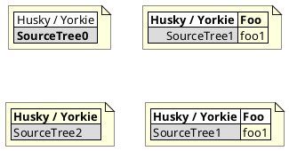

*[Ref. [QA-10923](https://forum.plantuml.net/10923/how-to-create-a-creole-table-without-a-bolded-first-row?show=10943#a10943)]*


## Tree

You can use ``|_`` characters to build a tree.

On common commands, like title:
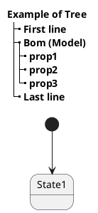

On Class diagram.

(Please note how we have to use an empty second compartment, else the parentheses in **(Model)** cause that text to be moved to a separate first compartment):
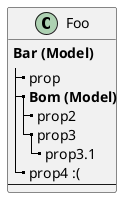
*[Ref. [QA-3448](https://forum.plantuml.net/3448)]*

On Component or Deployment diagrams:
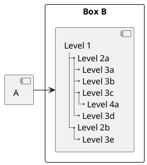
*[Ref. [QA-11365](https://forum.plantuml.net/11365/creole-trees-do-not-respect-indent-levels-component-diagram)]*


## Special characters

It's possible to use any [unicode character](http://www.fileformat.info/info/unicode/category/Sm/list.htm),
either directly or with syntax ``&#nnnnnn;`` (decimal) or ``<U+XXXXX>`` (hex):

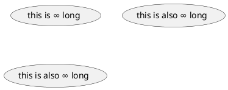

Please note that not all Unicode chars appear correctly, depending on installed fonts.
* You can use the [listfonts](https://plantuml.com/font) command with a test string of your desired characters, to see which fonts may include them.
* For characters that are emoji, it's better to use the [Emoji](https://plantuml.com/creole#68305e25f5788db0) notation that doesn't depend on installed fonts, and the emoji are colored.
* The PlantUML server has the "Noto Emoji" font that has most emoji. If you want to render diagrams on your local system, you should check which fonts you have.
* Unfortunately "Noto Emoji" lacks normal chars, so you need to switch fonts, eg
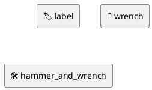

See [Issue 72](https://github.com/plantuml/plantuml/issues/72) for more details.


## Legacy HTML


You can mix Creole with the following HTML tags:
* ``<b>`` for bold text
* ``<u>`` or ``<u:#AAAAAA>`` or ``<u:[[color|colorName]]>`` for underline
* ``<i>`` for italic
* ``<s>`` or ``<s:#AAAAAA>`` or ``<s:[[color|colorName]]>`` for strike text
* ``<w>`` or ``<w:#AAAAAA>`` or ``<w:[[color|colorName]]>`` for wave underline text
* ``<plain>`` for plain text
* ``<color:#AAAAAA>`` or ``<color:[[color|colorName]]>``
* ``<back:#AAAAAA>`` or ``<back:[[color|colorName]]>`` for background color
* ``<size:nn>`` to change font size
* ```` : the file must be accessible by the filesystem
* ```` : the URL must be available from the Internet
* ``{scale:nn}`` to change image size, eg ````

```plantuml
@startuml
:* You can change <color:red>text color</color>
* You can change <back:cadetblue>background color</back>
* You can change <size:18>size</size>
* You use <u>legacy</u> <b>HTML <i>tag</i></b>
* You use <u:red>color</u> <s:green>in HTML</s> <w:#0000FF>tag</w>
----
* Use image : 
;
@enduml
```

### Common HTML element
```plantuml
@startuml
hide footbox
note over Source
<code>
  This is <b>bold</b>
  This is <i>italics</i>
  This is <font:monospaced>monospaced</font>
  This is <s>stroked</s>
  This is <u>underlined</u>
  This is <w>waved</w>
  This is <s:green>stroked</s>
  This is <u:red>underlined</u>
  This is <w:#0000FF>waved</w>
  This is <b>a bold text containing <plain>plain text</plain> inside</b>
  -- other examples --
  This is <color:blue>Blue</color>
  This is <back:orange>Orange background</back>
  This is <size:20>big</size>
</code>
end note
/note over Output
  This is <b>bold</b>
  This is <i>italics</i>
  This is <font:monospaced>monospaced</font>
  This is <s>stroked</s>
  This is <u>underlined</u>
  This is <w>waved</w>
  This is <s:green>stroked</s>
  This is <u:red>underlined</u>
  This is <w:#0000FF>waved</w>
  This is <b>a bold text containing <plain>plain text</plain> inside</b>
  -- other examples --
  This is <color:blue>Blue</color>
  This is <back:orange>Orange background</back>
  This is <size:20>big</size>
end note
@enduml

```

*[Ref. [QA-5254](https://forum.plantuml.net/5254) for ``plain``]*

### Subscript and Superscript element [sub, sup]
```plantuml
@startuml
:<code>
This is the "caffeine" molecule: C<sub>8</sub>H<sub>10</sub>N<sub>4</sub>O<sub>2</sub>
</code>
This is the "caffeine" molecule: C<sub>8</sub>H<sub>10</sub>N<sub>4</sub>O<sub>2</sub>
----
<code>
This is the Pythagorean theorem: a<sup>2</sup> + b<sup>2</sup> = c<sup>2</sup>
</code>
This is the Pythagorean theorem: a<sup>2</sup> + b<sup>2</sup> = c<sup>2</sup>;
@enduml
```


## OpenIconic


OpenIconic is a very nice open-source icon set.
Those icons are integrated in the creole parser, so you can use them out-of-the-box.

Use the following syntax: ``<&ICON_NAME>``.
```plantuml
@startuml
title: <size:20><&heart>Use of OpenIconic<&heart></size>
class Wifi
note left
  Click on <&wifi>
end note
@enduml
```

The complete list is available with the following special command:

```plantuml
@startuml
listopeniconic
@enduml
```


## Appendix: Examples of "Creole List" on all diagrams

### Activity

```plantuml
@startuml
start
:**test list 1**
* Bullet list
* Second item
** Sub item
*** Sub sub item
* Third item
----
**test list 2**
# Numbered list
# Second item
## Sub item
## Another sub item
# Third item;
stop
@enduml
```

### Class

[[#FFD700#FIXME]] 🚩
* *Sub item*
* *Sub sub item*
[[#FFD700#FIXME]] 

```plantuml
@startuml

class a {
**test list 1**
* Bullet list
* Second item
** Sub item
*** Sub sub item
* Third item
----
**test list 2**
# Numbered list
# Second item
## Sub item
## Another sub item
# Third item
}

a -- b 

@enduml
```

### Component, Deployment, Use-Case

```plantuml
@startuml
node n [
**test list 1**
* Bullet list
* Second item
** Sub item
*** Sub sub item
* Third item
----
**test list 2**
# Numbered list
# Second item
## Sub item
## Another sub item
# Third item
]

file f as "
**test list 1**
* Bullet list
* Second item
** Sub item
*** Sub sub item
* Third item
----
**test list 2**
# Numbered list
# Second item
## Sub item
## Another sub item
# Third item
"
@enduml
```

[[#98FB98#DONE]]
*[Corrected in [V1.2020.18](https://plantuml.com/changes)]*

### Gantt project planning

N/A


### Object

[[#FFD700#FIXME]] 
🚩
* *Sub item*
* *Sub sub item*
[[#FFD700#FIXME]] 

```plantuml
@startuml
object user {
**test list 1**
* Bullet list
* Second item
** Sub item
*** Sub sub item
* Third item
----	
**test list 2**
# Numbered list
# Second item
## Sub item
## Another sub item
# Third item
}

@enduml
```

### MindMap

```plantuml
@startmindmap

* root
** d1
**:**test list 1**
* Bullet list
* Second item
** Sub item
*** Sub sub item
* Third item
----
**test list 2**
# Numbered list
# Second item
## Sub item
## Another sub item
# Third item;


@endmindmap
```

### Network (nwdiag)
```plantuml
@startnwdiag
nwdiag {
  network Network {
      Server [description="**test list 1**\n* Bullet list\n* Second item\n** Sub item\n*** Sub sub item\n* Third item\n----\n**test list 2**\n# Numbered list\n# Second item\n## Sub item\n## Another sub item\n# Third item"];
}
@endnwdiag
```

### Note
```plantuml
@startuml
note as n
**test list 1**
* Bullet list
* Second item
** Sub item
*** Sub sub item
* Third item
----
**test list 2**
# Numbered list
# Second item
## Sub item
## Another sub item
# Third item
end note
@enduml
```

### Sequence

```plantuml
@startuml
<style>
participant {HorizontalAlignment left}
</style>
participant Participant [
**test list 1**
* Bullet list
* Second item
** Sub item
*** Sub sub item
* Third item
----
**test list 2**
# Numbered list
# Second item
## Sub item
## Another sub item
# Third item
]

participant B

Participant -> B
@enduml
```
*[Ref. [QA-15232](https://forum.plantuml.net/15232/)]*

### State

```plantuml
@startuml
<style>
stateDiagram {
title {HorizontalAlignment left}
}
</style>
state "**test list 1**\n* Bullet list\n* Second item\n** Sub item\n*** Sub sub item\n* Third item\n----\n**test list 2**\n# Numbered list\n# Second item\n## Sub item\n## Another sub item\n# Third item" as a {
a: **test list 1**\n* Bullet list\n* Second item\n** Sub item\n*** Sub sub item\n* Third item\n----\n**test list 2**\n# Numbered list\n# Second item\n## Sub item\n## Another sub item\n# Third item
state "**test list 1**\n* Bullet list\n* Second item\n** Sub item\n*** Sub sub item\n* Third item\n----\n**test list 2**\n# Numbered list\n# Second item\n## Sub item\n## Another sub item\n# Third item" as b
state : **test list 1**\n* Bullet list\n* Second item\n** Sub item\n*** Sub sub item\n* Third item\n----\n**test list 2**\n# Numbered list\n# Second item\n## Sub item\n## Another sub item\n# Third item
}
@enduml
```
*[Ref. [QA-16978](https://forum.plantuml.net/16978/can-i-center-the-description-text-at-the-bottom-the-state-box?show=16986#c16986)]*


### WBS

```plantuml
@startwbs

* root
** d1
**:**test list 1**
* Bullet list
* Second item
** Sub item
*** Sub sub item
* Third item
----
**test list 2**
# Numbered list
# Second item
## Sub item
## Another sub item
# Third item;

@endwbs
```


## Appendix: Examples of "Creole horizontal lines" on all diagrams

### Activity

[[#FFD700#FIXME]] 
🚩
strong line
`____`
[[#FFD700#FIXME]] 

```plantuml
@startuml
start
:You can have horizontal line
----
Or double line
====
Or strong line
____
Or dotted line
..My title..
Or dotted title
//and title... //
==Title==
Or double-line title
--Another title--
Or single-line title
Enjoy!;
stop
@enduml
```

### Class


```plantuml
@startuml

class a {
You can have horizontal line
----
Or double line
====
Or strong line
____
Or dotted line
..My title..
Or dotted title
//and title... //
==Title==
Or double-line title
--Another title--
Or single-line title
Enjoy!
}

a -- b 

@enduml
```

### Component, Deployment, Use-Case

```plantuml
@startuml
node n [
You can have horizontal line
----
Or double line
====
Or strong line
____
Or dotted line
..My title..
//and title... //
==Title==
--Another title--
Enjoy!
]

file f as "
You can have horizontal line
----
Or double line
====
Or strong line
____
Or dotted line
..My title..
//and title... //
==Title==
--Another title--
Enjoy!
"

person p [

You can have horizontal line
----
Or double line
====
Or strong line
____
Or dotted line
..My title..
//and title... //
==Title==
--Another title--
Enjoy!

]
@enduml
```

### Gantt project planning

N/A


### Object

```plantuml
@startuml
object user {
You can have horizontal line
----
Or double line
====
Or strong line
____
Or dotted line
..My title..
//and title... //
==Title==
--Another title--
Enjoy!
}

@enduml
```

[[#98FB98#DONE]]
*[Corrected on [V1.2020.18](https://plantuml.com/changes)]*

### MindMap

[[#FFD700#FIXME]] 
🚩
strong line
`____`
[[#FFD700#FIXME]] 
```plantuml
@startmindmap

* root
** d1
**:You can have horizontal line
----
Or double line
====
Or strong line
____
Or dotted line
..My title..
//and title... //
==Title==
--Another title--
Enjoy!;

@endmindmap
```

### Network (nwdiag)
```plantuml
@startnwdiag
nwdiag {
  network Network {
      Server [description="You can have horizontal line\n----\nOr double line\n====\nOr strong line\n____\nOr dotted line\n..My title..\n//and title... //\n==Title==\n--Another title--\nEnjoy!"];
}
@endnwdiag
```


### Note
```plantuml
@startuml
note as n
You can have horizontal line
----
Or double line
====
Or strong line
____
Or dotted line
..My title..
//and title... //
==Title==
--Another title--
Enjoy!
end note
@enduml
```


### Sequence

```plantuml
@startuml
<style>
participant {HorizontalAlignment left}
</style>
participant Participant [
You can have horizontal line
----
Or double line
====
Or strong line
____
Or dotted line
..My title..
//and title... //
==Title==
--Another title--
Enjoy!
]

participant B

Participant -> B
@enduml
```
*[Ref. [QA-15232](https://forum.plantuml.net/15232/)]*

### State

```plantuml
@startuml
<style>
stateDiagram {
title {HorizontalAlignment left}
}
</style>
state "You can have horizontal line\n----\nOr double line\n====\nOr strong line\n____\nOr dotted line\n..My title..\n//and title... //\n==Title==\n--Another title--\nEnjoy!" as a {
a: You can have horizontal line\n----\nOr double line\n====\nOr strong line\n____\nOr dotted line\n..My title..\n//and title... //\n==Title==\n--Another title--\nEnjoy!
state "You can have horizontal line\n----\nOr double line\n====\nOr strong line\n____\nOr dotted line\n..My title..\n//and title... //\n==Title==\n--Another title--\nEnjoy!" as b
state : You can have horizontal line\n----\nOr double line\n====\nOr strong line\n____\nOr dotted line\n..My title..\n//and title... //\n==Title==\n--Another title--\nEnjoy!
}
@enduml
```
*[Ref. [QA-16978](https://forum.plantuml.net/16978/can-i-center-the-description-text-at-the-bottom-the-state-box?show=16986#c16986), [GH-1479](https://github.com/plantuml/plantuml/issues/1479)]*


### WBS

[[#FFD700#FIXME]] 
🚩
strong line
`____`
[[#FFD700#FIXME]] 
```plantuml
@startwbs

* root
** d1
**:You can have horizontal line
----
Or double line
====
Or strong line
____
Or dotted line
..My title..
//and title... //
==Title==
--Another title--
Enjoy!;

@endwbs
```


## Style equivalent (between Creole and HTML)

| Style | Creole | Legacy HTML like |
| --- | --- | --- |
| **bold**       | This is ``**bold**``         | This is ``<b>bold</b>`` |
| *italics*    | This is ``//italics//``      | This is ``<i>italics</i>`` |
| ``monospaced`` | This is ``""monospaced""``   | This is ``<font:monospaced>monospaced</font>`` |
| ~~stroked~~    | This is ``--stroked--``      | This is ``<s>stroked</s>`` |
| __underlined__ | This is ``__underlined__``   | This is ``<u>underlined</u>`` |
| waved          | This is ``~~waved~~``        | This is ``<w>waved</w>`` |


```plantuml
@startmindmap
* Style equivalent\n(between Creole and HTML) 
**:**Creole**
----
<#silver>|= code|= output|
| \n This is ""~**bold**""\n | \n This is **bold** |
| \n This is ""~//italics//""\n | \n This is //italics// |
| \n This is ""~""monospaced~"" ""\n | \n This is ""monospaced"" |
| \n This is ""~--stroked--""\n | \n This is --stroked-- |
| \n This is ""~__underlined__""\n |  \n This is __underlined__ |
| \n This is ""<U+007E><U+007E>waved<U+007E><U+007E>""\n | \n This is ~~waved~~ |;
**:<b>Legacy HTML like
----
<#silver>|= code|= output|
| \n This is ""~<b>bold</b>""\n | \n This is <b>bold</b> |
| \n This is ""~<i>italics</i>""\n | \n This is <i>italics</i> |
| \n This is ""~<font:monospaced>monospaced</font>""\n | \n This is <font:monospaced>monospaced</font> |
| \n This is ""~<s>stroked</s>""\n | \n  This is <s>stroked</s> |
| \n This is ""~<u>underlined</u>""\n | \n This is <u>underlined</u> |
| \n This is ""~<w>waved</w>""\n | \n This is <w>waved</w> |

And color as a bonus...
<#silver>|= code|= output|
| \n This is ""~<s:""<color:green>""green""</color>"">stroked</s>""\n | \n  This is <s:green>stroked</s> |
| \n This is ""~<u:""<color:red>""red""</color>"">underlined</u>""\n | \n This is <u:red>underlined</u> |
| \n This is ""~<w:""<color:#0000FF>""#0000FF""</color>"">waved</w>""\n | \n This is <w:#0000FF>waved</w> |;
@endmindmap
```


## Creole on Creole 

You can use [Creole or HTML Creole](creole) on Creole diagram:
```plantuml
@startcreole
==Creole
  This is **bold**
  This is //italics//
  This is ""monospaced""
  This is --stricken-out--
  This is __underlined__
  This is ~~wave-underlined~~
test Unicode and icons
  This is <U+221E> long
  This is a <&code> icon
  Use image : 

<b>HTML Creole 
  This is <b>bold</b>
  This is <i>italics</i>
  This is <font:monospaced>monospaced</font>
  This is <s>stroked</s>
  This is <u>underlined</u>
  This is <w>waved</w>
  This is <s:green>stroked</s>
  This is <u:red>underlined</u>
  This is <w:#0000FF>waved</w>
other examples
  This is <color:blue>Blue</color>
  This is <back:orange>Orange background</back>
  This is <size:20>big</size>

Creole list item
**test list 1**
* Bullet list
* Second item
** Sub item
*** Sub sub item
* Third item

**test list 2**
# Numbered list
# Second item
## Sub item
## Another sub item
# Third item
@endcreole
```


