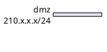
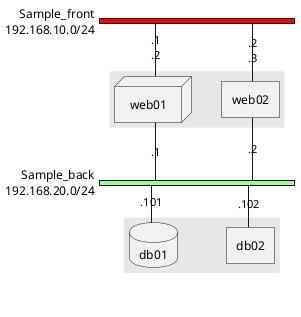
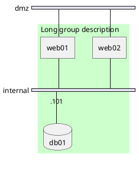
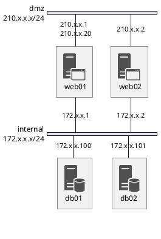
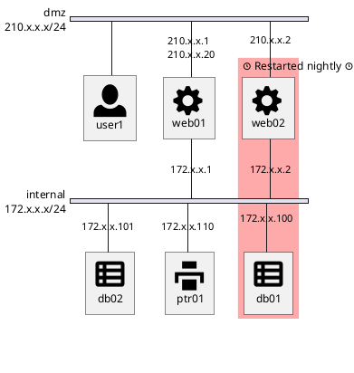
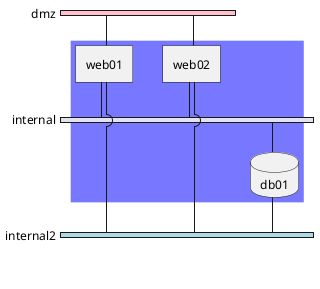
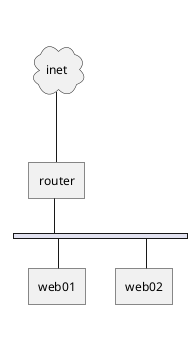
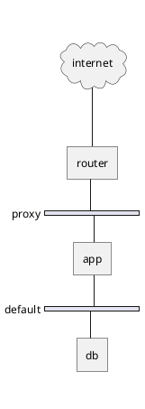
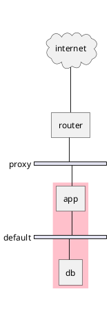
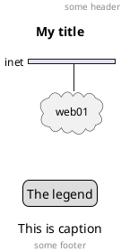

# Network Diagram with nwdiag

A [network diagram](https://en.wikipedia.org/wiki/Computer_network_diagram) is a visual representation of a computer or telecommunications network. It illustrates the **arrangement and interconnections** of network components, including servers, routers, switches, hubs, and devices. Network diagrams are invaluable tools for network engineers and administrators to **understand, set up, and troubleshoot networks**. They are also essential for **visualizing the structure and flow of data** in a network, ensuring optimal performance and security.

[nwdiag](http://blockdiag.com/en/nwdiag/nwdiag-examples.html), developed by [Takeshi Komiya](https://twitter.com/tk0miya), provides a streamlined platform to swiftly sketch **network diagrams**. We extend our gratitude to Takeshi for this **innovative tool**!

Given its intuitive syntax, [nwdiag](http://blockdiag.com/en/nwdiag/nwdiag-examples.html) has been seamlessly integrated into **PlantUML**. The examples showcased here are inspired by the ones documented by [Takeshi](https://twitter.com/tk0miya).


## Simple diagram

### Define a network

To make the process more efficient, it is now possible to bypass the `nwdiag { ... }` wrapper. You can define your network directly within the PlantUML tags.

**Standard approach:**


**Simplified approach:**
We have introduced this to simplify the syntax and reduce boilerplate code:
```plantuml
@startnwdiag
network dmz {
  address = "210.x.x.x/24"
}
@endnwdiag
```

### Define some elements or servers on a network
```plantuml
@startnwdiag
  network dmz {
      address = "210.x.x.x/24"

      web01 [address = "210.x.x.1"];
      web02 [address = "210.x.x.2"];
  }
@endnwdiag
```

### Full example
```plantuml
@startnwdiag
  network dmz {
      address = "210.x.x.x/24"

      web01 [address = "210.x.x.1"];
      web02 [address = "210.x.x.2"];
  }
  network internal {
      address = "172.x.x.x/24";

      web01 [address = "172.x.x.1"];
      web02 [address = "172.x.x.2"];
      db01;
      db02;
  }
@endnwdiag
```


## Define multiple addresses

```plantuml
@startnwdiag
  network dmz {
      address = "210.x.x.x/24"

      // set multiple addresses (using comma)
      web01 [address = "210.x.x.1, 210.x.x.20"];
      web02 [address = "210.x.x.2"];
  }
  network internal {
      address = "172.x.x.x/24";

      web01 [address = "172.x.x.1"];
      web02 [address = "172.x.x.2"];
      db01;
      db02;
  }
@endnwdiag
```


## Grouping nodes

### Define group inside network definitions
```plantuml
@startnwdiag
  network Sample_front {
    address = "192.168.10.0/24";

    // define group
    group web {
      web01 [address = ".1"];
      web02 [address = ".2"];
    }
  }
  network Sample_back {
    address = "192.168.20.0/24";
    web01 [address = ".1"];
    web02 [address = ".2"];
    db01 [address = ".101"];
    db02 [address = ".102"];

    // define network using defined nodes
    group db {
      db01;
      db02;
    }
  }
@endnwdiag
```

### Define group outside of network definitions
```plantuml
@startnwdiag
  // define group outside of network definitions
  group {
    color = "#FFAAAA";

    web01;
    web02;
    db01;
  }

  network dmz {
    web01;
    web02;
  }
  network internal {
    web01;
    web02;
    db01;
    db02;
  }
@endnwdiag
```

### Define several groups on same network
#### Example with 2 group
```plantuml
@startnwdiag
  group {
    color = "#FFaaaa";
    web01;
    db01;
  }
  group {
    color = "#aaaaFF";
    web02;
    db02;
  }
  network dmz {
      address = "210.x.x.x/24"

      web01 [address = "210.x.x.1"];
      web02 [address = "210.x.x.2"];
  }
  network internal {
      address = "172.x.x.x/24";

      web01 [address = "172.x.x.1"];
      web02 [address = "172.x.x.2"];
      db01 ;
      db02 ;
  }
@endnwdiag
```
*[Ref. [QA-12663](https://forum.plantuml.net/12663)]*

#### Example with 3 groups
```plantuml
@startnwdiag
  group {
    color = "#FFaaaa";
    web01;
    db01;
  }
  group {
    color = "#aaFFaa";
    web02;
    db02;
  }
  group {
    color = "#aaaaFF";
    web03;
    db03;
  }

  network dmz {
      web01;
      web02;
      web03;
  }
  network internal {
      web01;
      db01 ;
      web02;
      db02 ;
      web03;
      db03;
  }
@endnwdiag
```
*[Ref. [QA-13138](https://forum.plantuml.net/13138)]*


## Extended Syntax (for network or group)

### Network 

For network or network's component, you can add or change:
* addresses *(separated by comma ``,``)*;
* [color](color);
* description;
* [shape](deployment-diagram#5k3cq00k8n5ek362kjdn).



### Group

For a group, you can add or change:
* [color](color);
* description.



*[Ref. [QA-12056](https://forum.plantuml.net/12056)]*


## Using Sprites

You can use all [sprites](sprite) (icons) from the [Standard Library](stdlib) or any other library.

Use the notation `<$sprite>` to use a sprite, `\\n` to make a new line, or any other [Creole](creole) syntax.




*[Ref. [QA-11862](https://forum.plantuml.net/11862/nwdiag-beautifier?show=11866#a11866)]*


## Using OpenIconic

You can also use the icons from [OpenIconic](openiconic) in network or node descriptions.

Use the notation `<&icon>` to make an icon, ``<&icon*n>`` to multiply the size by a factor `n`, and `\\n` to make a newline:




## Same nodes on more than two networks

You can use same nodes on different networks (more than two networks); *nwdiag* use in this case *'jump line'* over networks.




## Peer networks

Peer networks are simple connections between two nodes, for which we don't use a horizontal "busbar" network



## Peer networks and group

### Without group


### Group on first


### Group on second


### Group on third


*[Ref. [Issue#408](https://github.com/plantuml/plantuml/issues/408) and [QA-12655](https://forum.plantuml.net/12655/nwdiag-overlapp-problem-with-3-newtorks?show=12661#c12661)]*


## Add title, caption, header, footer or legend on network diagram



*[Ref. [QA-11303](https://forum.plantuml.net/11303/nwdiag-ignores-on-title-keyword-in-plantuml-1-2020-7) and [Common commands](commons)]*


## With or without shadow

### With shadow (by default)
```plantuml
@startnwdiag
nwdiag {
  network nw {
    server;
    internet;
  }
  internet [shape = cloud];
}
@endnwdiag
```


### Without shadow
```plantuml
@startnwdiag
<style>
root {
 shadowing 0
}
</style>
nwdiag {
  network nw {
    server;
    internet;
  }
  internet [shape = cloud];
}
@endnwdiag
```

*[Ref. [QA-14516](https://forum.plantuml.net/14516/)]*


## Change width of the networks

You can change the width of the networks, especially in order to have the same full width for only some or all networks.

Here are some examples, with all the possibilities.

### First example
* without
```plantuml
@startnwdiag
nwdiag {
  network NETWORK_BASE {
   dev_A [address = "dev_A" ]
   dev_B [address = "dev_B" ]
  }
  network IntNET1 {
   dev_B [address = "dev_B1" ]
   dev_M [address = "dev_M1" ]
  }
  network IntNET2 {
   dev_B [address = "dev_B2" ]
   dev_M [address = "dev_M2" ]
 }
}
@endnwdiag
```

* only the first
```plantuml
@startnwdiag
nwdiag {
  network NETWORK_BASE {
   width = full
   dev_A [address = "dev_A" ]
   dev_B [address = "dev_B" ]
  }
  network IntNET1 {
   dev_B [address = "dev_B1" ]
   dev_M [address = "dev_M1" ]
  }
  network IntNET2 {
   dev_B [address = "dev_B2" ]
   dev_M [address = "dev_M2" ]
 }
}
@endnwdiag
```

* the first and the second
```plantuml
@startnwdiag
nwdiag {
  network NETWORK_BASE {
   width = full
   dev_A [address = "dev_A" ]
   dev_B [address = "dev_B" ]
  }
  network IntNET1 {
   width = full
   dev_B [address = "dev_B1" ]
   dev_M [address = "dev_M1" ]
  }
  network IntNET2 {
   dev_B [address = "dev_B2" ]
   dev_M [address = "dev_M2" ]
 }
}
@endnwdiag
```

* all the network (with same full width)
```plantuml
@startnwdiag
nwdiag {
  network NETWORK_BASE {
   width = full
   dev_A [address = "dev_A" ]
   dev_B [address = "dev_B" ]
  }
  network IntNET1 {
   width = full
   dev_B [address = "dev_B1" ]
   dev_M [address = "dev_M1" ]
  }
  network IntNET2 {
   width = full
   dev_B [address = "dev_B2" ]
   dev_M [address = "dev_M2" ]
 }
}
@endnwdiag
```

### Second example

* without
```plantuml
@startnwdiag
nwdiag {
  e1
  network n1 {
    e1
    e2
    e3
  }

  network n2 {
    e3
    e4
    e5
  }

  network n3 {
    e2
    e6
  }
}
@endnwdiag
```

* only the first
```plantuml
@startnwdiag
nwdiag {
  e1
  network n1 {
    width = full
    e1
    e2
    e3
  }

  network n2 {
    e3
    e4
    e5
  }

  network n3 {
    e2
    e6
  }
}
@endnwdiag
```

* the first and the second
```plantuml
@startnwdiag
nwdiag {
  e1
  network n1 {
    width = full
    e1
    e2
    e3
  }

  network n2 {
    width = full
    e3
    e4
    e5
  }

  network n3 {
    e2
    e6
  }
}
@endnwdiag
```

* all the network (with same full width)
```plantuml
@startnwdiag
nwdiag {
  e1
  network n1 {
    width = full
    e1
    e2
    e3
  }

  network n2 {
    width = full
    e3
    e4
    e5
  }

  network n3 {
    width = full
    e2
    e6
  }
}
@endnwdiag
```


## Other internal networks

You can define other internal networks (TCP/IP, USB, SERIAL,...).

* Without address or type
```plantuml
@startnwdiag
nwdiag {
  network LAN1 {
     a [address = "a1"];
  }
  network LAN2 {
     a [address = "a2"];
     switch;
  }
  switch -- equip;
  equip -- printer;
}
@endnwdiag
```


* With address or type
```plantuml
@startnwdiag
nwdiag {
  network LAN1 {
     a [address = "a1"];
  }
  network LAN2 {
     a [address = "a2"];
     switch [address = "s2"];
  }
  switch -- equip;
  equip [address = "e3"];
  equip -- printer;
  printer [address = "USB"];
}
@endnwdiag
```

*[Ref. [QA-12824](https://forum.plantuml.net/12824)]*


## Using (global) style

### Without style *(by default)*
```plantuml
@startnwdiag
nwdiag {
  network DMZ {
      address = "y.x.x.x/24"
      web01 [address = "y.x.x.1"];
      web02 [address = "y.x.x.2"];
  }

   network Internal {
    web01;
    web02;
    db01 [address = "w.w.w.z", shape = database];
  } 

    group {
    description = "long group label";
    web01;
    web02;
    db01;
  }
}
@endnwdiag
```


### With style

You can use [style](style-evolution) to change rendering of elements.

```plantuml
@startnwdiag
<style>
nwdiagDiagram {
  network {
    BackGroundColor green
    LineColor red
    LineThickness 1.0
    FontSize 18
    FontColor navy
  }
  server {
    BackGroundColor pink
    LineColor yellow
    LineThickness 1.0
    ' FontXXX only for description or label
    FontSize 18
    FontColor #blue
  }
  arrow {
    ' FontXXX only for address 
    FontSize 17
    FontColor #red
    FontName Monospaced
    LineColor black
  }
  group {
    BackGroundColor cadetblue
    LineColor black
    LineThickness 2.0
    FontSize 11
    FontStyle bold
    Margin 5
    Padding 5
  }
}
</style>
nwdiag {
  network DMZ {
      address = "y.x.x.x/24"
      web01 [address = "y.x.x.1"];
      web02 [address = "y.x.x.2"];
  }

   network Internal {
    web01;
    web02;
    db01 [address = "w.w.w.z", shape = database];
  } 

    group {
    description = "long group label";
    web01;
    web02;
    db01;
  }
}
@endnwdiag
```

*[Ref. [QA-14479](https://forum.plantuml.net/14479)]*


## Appendix: Test of all shapes on Network diagram (nwdiag)

```plantuml
@startnwdiag
nwdiag {
  network Network {
    Actor       [shape = actor]       
    Agent       [shape = agent]       
    Artifact    [shape = artifact]    
    Boundary    [shape = boundary]    
    Card        [shape = card]        
    Cloud       [shape = cloud]       
    Collections [shape = collections] 
    Component   [shape = component]   
  }
}
@endnwdiag
```

```plantuml
@startnwdiag
nwdiag {
  network Network {
    Control     [shape = control]     
    Database    [shape = database]    
    Entity      [shape = entity]      
    File        [shape = file]        
    Folder      [shape = folder]      
    Frame       [shape = frame]       
    Hexagon     [shape = hexagon]     
    Interface   [shape = interface]   
  }
}
@endnwdiag
```

```plantuml
@startnwdiag
nwdiag {
  network Network {
    Label       [shape = label]       
    Node        [shape = node]        
    Package     [shape = package]     
    Person      [shape = person]      
    Queue       [shape = queue]       
    Stack       [shape = stack]       
    Rectangle   [shape = rectangle]   
    Storage     [shape = storage]     
    Usecase     [shape = usecase]     
  }
}
@endnwdiag
```

[[#FFAAAA#FIXME]]
1. Overlap of label for folder
1. Hexagon shape is missing

```plantuml
@startnwdiag
nwdiag {
network Network {
Folder [shape = folder]
Hexagon [shape = hexagon]
}
}
@endnwdiag
```

```plantuml
@startnwdiag
nwdiag {
network Network {
Folder [shape = folder, description = "Test, long long label\nTest, long long label"]
Hexagon [shape = hexagon, description = "Test, long long label\nTest, long long label"]
}
}
@endnwdiag
```

[[#FFAAAA#FIXME]]


