# Visualizing Regex with PlantUML

## Introduction to Regex and Visualization Challenges

[Regular expressions (Regex)](https://en.wikipedia.org/wiki/Regular_expression) are powerful tools in programming, used for pattern matching and text manipulation. While extremely useful, regex patterns can often be dense and difficult to interpret, especially as they grow in complexity. The syntax, although efficient, can become obscure and hard to read for both beginners and experienced developers. This is where visual tools like PlantUML come into play.

## Why PlantUML for Regex?

### Simplifying Complexity with Visualization
PlantUML, a popular tool for creating UML diagrams, offers a unique feature for those grappling with the intricacies of regex. By turning regex patterns into visual diagrams, PlantUML helps in:

- **Demystifying Regex Syntax:** The visual representation breaks down the regex into comprehensible components, making it easier to understand each part of the expression.
- **Enhancing Pattern Recognition:** Visual diagrams allow users to identify repeating patterns and structures in regex, which might be missed in the textual form.
- **Debugging and Optimization:** By laying out the regex structure visually, PlantUML can aid in spotting redundancies and errors, facilitating more efficient pattern design.

### An Invaluable Tool for Learning and Collaboration
- For learners, visual diagrams serve as educational aids, simplifying the learning curve associated with regex syntax.
- In collaborative environments, visual representations can bridge the gap in understanding, ensuring that team members are on the same page regarding the logic and function of a regex pattern.

By transforming abstract regex patterns into tangible diagrams, PlantUML not only aids in comprehension but also enhances the overall experience of working with regular expressions. Whether you are a novice trying to get a grip on regex syntax or a seasoned developer looking to optimize complex patterns, PlantUML's visualization feature can be an invaluable asset.


## Fundamentals of Regular Expressions

**Literal Text**: PlantUML can visualize simple literal texts in regular expressions, as shown with the example `abc`.

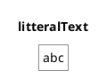


## Character Classes and Sequences

### Shorthand Character Classes

In regular expressions, shorthand character classes offer a concise way to match common character types. The class `\d` matches any digit, `\w` matches any word character (including letters, digits, and underscores), and `\s` matches any whitespace character (including spaces, tabs, and line breaks).

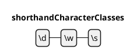

### Literal Character Sequences

To ensure that a specific sequence of characters is interpreted exactly as written, without any special meaning, the `\Q...\E` escape sequence is used. For example, `\Qfoo\E` treats "foo" as a literal string, not as separate characters with potential special meanings in regex.

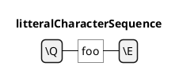


### Character Ranges

Character ranges are a flexible way to specify a set of characters to match. For instance, `[0-9]` represents any digit from 0 to 9. This is particularly useful for matching characters within a specific range, like letters or numbers.

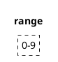

### Any Character

The dot `.` in regular expressions is a powerful tool that matches any character except for newline characters. It's often used when the specific character is not important, or when matching a wide range of characters.

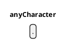


### Special Escapes

Special escape sequences in regular expressions provide a way to include non-printable and hard-to-type characters in patterns. For example, `\t` represents a tab, `\r` a carriage return, and `\n` a newline. These escapes are essential for patterns that involve whitespace or other non-visible characters.

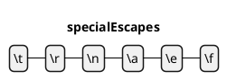


## Descriptive Name and Language 

You can activate the Descriptive Names with ``!option useDescriptiveNames true``.
Then you can also choose the language of the Descriptive Names, with the  ``!option language <xx>`` option where ``<xx>`` is the [ISO 639 code](https://en.wikipedia.org/wiki/List_of_ISO_639-1_codes) of the language.

### Without Descriptive Name *(by default)*
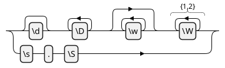


### With Descriptive Name

#### English (en)


#### Deutsch (de)


#### Japanese (ja)


*[Ref. [GH-2036](https://github.com/plantuml/plantuml/pull/2036)]*


## Special Escapes

### Octal and Unicode Escapes

Regular expressions can also include octal and Unicode escapes to represent specific characters.

PlantUML Code for Octal Escapes: 
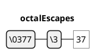

PlantUML Code for Unicode Escapes: 
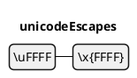


## Repetitions and Alternation

### Repetitions

Regular expressions provide versatile options for specifying how many times a particular pattern should occur. These repetition constructs make it possible to match varying lengths of text and are fundamental to the flexibility of regex.

#### Optional Repetition

The `?` symbol indicates that the preceding element is optional, meaning it may appear zero or one time. For example, `ab?` matches either "a" or "ab".

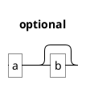

#### Required Repetition

The `+` symbol requires the preceding element to appear one or more times. In the pattern `ab+`, "b" must occur at least once following "a".

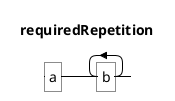

#### Zero or More Repetitions

The "*" symbol allows the preceding element to appear zero or more times.
For instance, "ab*" matches "a", "ab", "abb", "abbb", and so on.

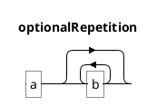


#### Specified Range of Repetitions
Curly braces `{}` are used to specify an exact number or range of repetitions. For example, `ab{1,2}` matches "ab" or "abb".

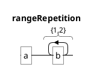


#### Minimum Number of Repetitions
To indicate a minimum number of repetitions, use the format `{n,}`. In `ab{1}c{1,}`, "a" is followed by at least one "b" and one or more "c".

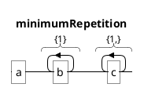


#### Repetition Equivalence
Repetition constructs can often be expressed in multiple ways. For instance, `a{0,1}b{1,}` is equivalent to `a?b+`, both representing "a" as optional and "b" as required one or more times.

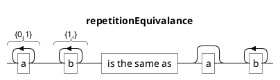


### Alternation

Alternation, represented by the `|` symbol, allows choosing between multiple sequences, as in the example `a|b`, where either "a" or "b" is accepted.

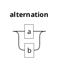


## Unicode

### Unicode Categories

Unicode character categories in regular expressions allow for the matching of specific types of characters, such as letters or numbers, across various languages and scripts. PlantUML can visualize these categories, making it easier to understand their coverage.

- **Letters (`\p{L}`)**: Matches any letter from any language.
- **Lowercase Letters (`\p{Ll}`)**: Specifically matches lowercase letters.


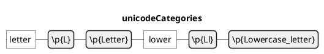

### Unicode Scripts

Unicode scripts are used to match characters from specific writing systems. For example, `\p{Latin}` matches any character from the Latin script, commonly used in Western languages.

```plantuml
@startregex
title unicodeScripts
latin \p{Latin}
@endregex
```

### Unicode Blocks

Unicode blocks refer to specific ranges of characters as defined in the Unicode standard. For instance, `\p{InGeometric_Shapes}` matches characters that are part of the Geometric Shapes block.

```plantuml
@startregex
title unicodeBlocks
\p{InGeometric_Shapes}
@endregex
```


