## CSS Styles in PlantUML

PlantUML now supports **CSS-like styling** through the `<style>` tag, providing precise control over diagram elements such as **participants, arrows, and global settings**. This new feature is set to replace the older `skinparam` approach, which is now **deprecated**.

Users can leverage the familiar CSS syntax to apply **global styles** or target **specific diagram types** and individual elements. This allows customization of properties like **colors, fonts, borders, spacing, and sizes**, ensuring a consistent and professional visual presentation. The modular and reusable nature of CSS-like styles greatly simplifies style management and enhances maintainability, as changes can be made centrally and propagated throughout all diagrams.

In summary, adopting CSS styles in PlantUML not only modernizes diagram styling but also replaces the deprecated `skinparam`, enabling developers and designers to create visually cohesive, polished diagrams with ease.

## Getting Started

PlantUML’s styling is designed to be intuitive for anyone familiar with CSS. In this section, we'll cover the basics of the syntax, how to apply styles, and the differences between global and element-specific styling.

### Basic syntax and how to apply styles

To begin styling your diagrams, you simply include a `<style>` section at the top of your PlantUML file. Inside this section, you can define your style rules using a syntax very similar to standard CSS. These rules are then applied to the various components of your diagram.

Here's a basic example:

```plantuml
@startuml
<style>
  /* Global style applied to all elements */
  element {
    BackGroundColor: #AAA;
  }

  /* Specific styles for a sequence diagram */
  sequenceDiagram {
    participant {
      FontColor: green;
      FontSize: 26;
      FontStyle: italic;
      LineColor: #E00;
    }
    arrow {
      FontColor: red;
      LineColor: blue;
    }
  }
</style>

participant Alice
participant Bob

Alice -> Bob : hello

@enduml
```

In the example above:

- The `element` selector applies a background color to all diagram elements.
- The `sequenceDiagram` block targets sequence diagrams specifically, allowing for more refined styling within that context.
- Within the `sequenceDiagram` block, the `participant` and `arrow` selectors define styles for participants and arrows respectively.

### Global vs. element-specific styles

**Global styles:**
- **Definition**: Rules applied to the `element` selector affect every part of your diagram.
- **Usage**: Use global styles to set defaults, such as background colors, that should be consistent throughout your entire diagram.

**Element-specific styles:**
- **Definition**: These styles are applied only to specified parts of the diagram, such as `sequenceDiagram`, `participant`, or `arrow`.
- **Usage**: This approach is useful when you need to customize only certain components of your diagram. For instance, if you want to highlight participants in a sequence diagram differently from other elements, you can define rules under the `participant` selector.

By understanding the distinction between global and element-specific styles, you can effectively manage the appearance of your diagrams. Global styles help maintain consistency, while element-specific styles provide the flexibility to introduce detailed customization where needed.

This modular approach allows you to easily update and maintain the visual presentation of your diagrams, ensuring they are both aesthetically pleasing and aligned with your design requirements.

## Detailed property reference

Below is a detailed overview of all the supported CSS-like properties in PlantUML, grouped by functionality. Each table outlines the purpose of the properties within that category.

### Typography

| Property      | Description                                          |
| ------------- | ---------------------------------------------------- |
| **FontName**  | Sets the font family for text elements.              |
| **FontColor** | Sets the color of the text.                          |
| **FontSize**  | Specifies the size of the text.                      |
| **FontStyle** | Defines the text style (e.g., bold, italic, normal). |

### Color and background

| Property            | Description                              |
| ------------------- | ---------------------------------------- |
| **BackGroundColor** | Sets the background color of an element. |
| **HyperLinkColor**  | Sets the color used for hyperlinks.      |

### Borders and corners

| Property           | Description                                           |
| ------------------ | ----------------------------------------------------- |
| **RoundCorner**    | Sets the radius for rounding the corners of elements. |
| **DiagonalCorner** | Applies a diagonal cut effect to element corners.     |
| **LineColor**      | Specifies the color of lines or borders.              |
| **LineThickness**  | Sets the thickness of lines or borders.               |
| **LineStyle**      | Defines the line style (solid, dashed, dotted, etc.). |

### Spacing and sizing

| Property         | Description                                        |
| ---------------- | -------------------------------------------------- |
| **Padding**      | Sets the internal spacing within an element.       |
| **Margin**       | Defines the external spacing around an element.    |
| **MaximumWidth** | Specifies the maximum width an element can occupy. |

### Additional visuals and effects

| Property                        | Description                                                                 |
| ------------------------------- | --------------------------------------------------------------------------- |
| **Shadowing**                   | Adds a shadow effect by specifying a numeric value for the shadow distance. |
| **HyperlinkUnderlineStyle**     | Specifies the underline style for hyperlinks.                               |
| **HyperlinkUnderlineThickness** | Specifies the thickness of the hyperlink underline.                         |
| **HorizontalAlignment**         | Aligns content horizontally (left, center, or right).                       |

These properties are designed to offer you a comprehensive set of tools for customizing every visual aspect of your PlantUML diagrams. By combining and adjusting these settings, you can create diagrams that are both functional and visually appealing, tailored to your specific design and presentation needs.

## Advanced Examples

In this section, we explore some advanced techniques to leverage the full power of CSS-like styling in PlantUML. You'll learn how to combine multiple styles, use class selectors for custom styling.

### Example 1: sequence – combining multiple styles

This example demonstrates how to define a global style and then override specific styles for elements in a sequence diagram.

```plantuml
@startuml
<style>
  /* Global style for all elements */
  element {
    BackGroundColor: #f5f5f5;
  }

  /* Specific styles for sequence diagrams */
  sequenceDiagram {
    participant {
      FontColor: darkblue;
      FontSize: 24;
      FontStyle: bold;
    }
    arrow {
      LineColor: #008000;
      FontColor: #006400;
    }
  }
</style>

participant Alice
participant Bob

Alice -> Bob : Combined Styles Example

@enduml
```

### Example 2: sequence – using selectors for custom styles

This example shows how to apply different styles to participants by using custom class selectors based on their roles.

```plantuml
@startuml
<style>
  sequenceDiagram {
    .primary {
      FontColor: darkred;
      FontSize: 16;
      FontStyle: bold;
      BackGroundColor: #ffe6e6;
    }
    .secondary {
      FontColor: gray;
      FontSize: 14;
      FontStyle: italic;
      BackGroundColor: #f0f0f0;
    }
    arrow {
      LineColor: #ff6600;
      FontColor: #0000ff;
    }
  }
</style>

participant "Alice (Primary)" as Alice <<primary>>
participant "Bob (Secondary)" as Bob <<secondary>>

Alice -> Bob : Message

@enduml
```

### Example 3: classes – custom class style

This class diagram demonstrates how to use a custom class (`mystyle`) to override default styles for a particular class.

```plantuml
@startuml
<style>
classDiagram {
    RoundCorner 15
    .mystyle {
        RoundCorner 5
        BackgroundColor cyan
        FontStyle Bold
        FontColor red
    }
}
</style>
class Alice <<<mystyle>>>
@enduml
```

**Explanation:**  
- All classes have a default round corner of 15.  
- The custom class `.mystyle` further customizes the appearance of the class `Alice`.

### Example 4: classes – multiple custom class styles

This example demonstrates how to apply different custom styles to various classes using multiple class selectors.

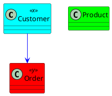

**Explanation:**  
- The default background color for classes is bright green (`#00ff00`).  
- The custom selectors `.x` and `.y` override the background colors to cyan and red respectively.

### Example 5: classes – visibility icon styling

This example illustrates how to style visibility icons (for example, for protected members in class diagrams).

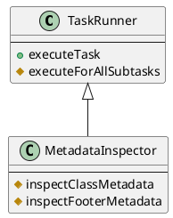

**Explanation:**  
- The `visibilityIcon` style targets protected members, setting both their line and background colors to DarkGoldenRod.  
- This helps visually distinguish protected elements in the diagram.

### Example 6: objects – global and specific styling

This object diagram applies a global style at the root level and a specific style for objects, enabling clear visual distinctions.

```plantuml
@startuml
<style>
root {
  FontColor Red
  BackgroundColor palegreen
}
objectDiagram {
  object {
      FontColor blue
      BackgroundColor yellow
  }
}
</style>

object PaymentService
object Customer {
  name = "John Doe"
  id = 456
}

PaymentService -> Customer
@enduml
```

**Explanation:**  
- The `root` style applies a red font color and a pale green background to the diagram’s root elements.  
- The style defined in `objectDiagram` targets only the objects.

### Example 7: mindmap – basic node styling

This mindmap example shows how to customize nodes with properties such as padding, alignment, border color/thickness, background color, and rounded corners.

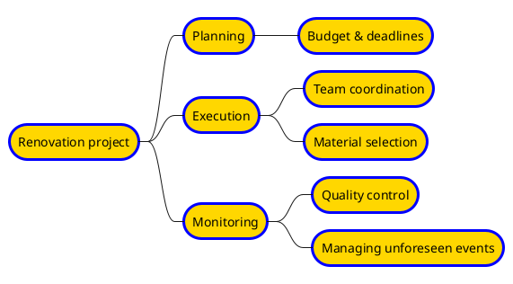

**Explanation:**  
- All nodes are styled with padding, centered text, blue borders (thickness 3.0), a gold background, and rounded corners (radius 40).

### Example 8: mindmap – detailed node styling with width constraints

This example further customizes the mindmap with properties like margin, maximum width, and shadowing to handle long text effectively.

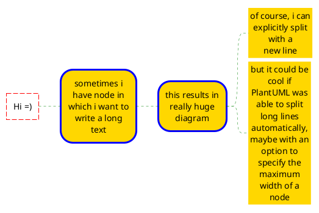

**Explanation:**  
- The detailed styling controls spacing and maximum width to prevent overly extended diagrams.

### Example 9: wbs – depth-based styling

This work breakdown structure (WBS) diagram demonstrates how to apply styles based on node depth and assigned class selectors.

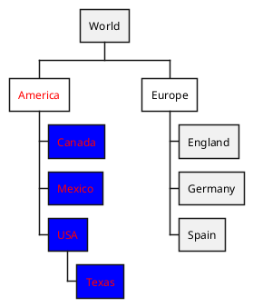

**Explanation:**  
- The styling varies according to the node's depth and assigned class, allowing for clear hierarchical visualization.

### Example 10: json – styling a json diagram

This example styles a JSON diagram by setting properties for nodes and arrows. Note that the last defined value takes precedence, which is useful for layered styles.

```plantuml
@startjson
<style>
jsonDiagram {
  node {
    FontName Helvetica
    FontColor Coral
    FontSize 12
    FontStyle bold
    BackGroundColor Khaki
    LineColor lightblue
  }
  arrow {
    BackGroundColor lightblue
    LineColor green
  }
}
</style>
{
    "quiz": {
        "question": "2+2?",
        "options": ["3", "4", "5"],
        "answer": "4"
    }
}
@endjson
```

**Explanation:**  
- The node style sets the font to Helvetica, Coral text with bold style at size 12, a Khaki background, and a light blue border.  
- Arrows are styled with a light blue background and green line.

### Example 11: arrows – customizing with class selectors

This diagram shows how to customize arrow properties using class selectors. Different classes (`va` and `vb`) adjust the line and font colors of the arrows.

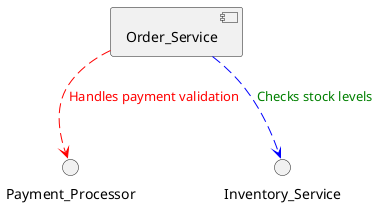

**Explanation:**  
- The default arrow style is set to green.  
- The `.critical` class changes arrows to red, while the `.supporting` class changes them to blue.

### Example 12: timing – class-based color customization

This timing diagram uses a custom class (`bluecolor`) to apply a blue background to concise elements, demonstrating class-based customization.

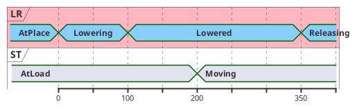

**Explanation:**  
- The `.bluecolor` class gives the element a blue background, combined here with a red font color.

### Example 13: timing – timeline customization

This example customizes the appearance of a timing diagram’s timeline using various properties such as font settings, line styles, and background color.

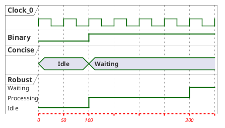

**Explanation:**  
- The timeline is styled with red italic text (size 10) and a pink background, with red lines drawn in a specific style and thickness for improved clarity.

### Example 14: gantt – task status styling

This gantt diagram shows how to visually distinguish task statuses (such as unstarted or undone) by applying different background and line colors.

```plantuml
@startgantt
<style>
ganttDiagram {
  task {
    BackGroundColor GreenYellow
    LineColor Green 
    unstarted {
      BackGroundColor Fuchsia 
    }
  }
  undone {
    BackGroundColor red
  }
}
</style>

[Prototype Design] lasts 7 days
[Functional Testing] lasts 4 days
[Performance Testing] lasts 4 days

[Functional Testing] starts at [Prototype Design]'s end
[Performance Testing] starts at [Prototype Design]'s end

[Functional Testing] is 0% complete
[Performance Testing] is 80% complete
@endgantt
```

**Explanation:**  
- Different background colors help quickly identify the status of each task in the timeline.

## Conclusion

CSS-like styling in PlantUML offers a powerful way to customize diagrams, ensuring clarity and consistency. By adjusting properties such as colors, fonts, and shapes, you can create visually distinct and well-structured diagrams. Styles can be applied globally for uniformity or selectively for more granular control, allowing you to tailor the appearance to your needs.

