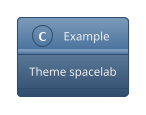
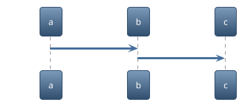
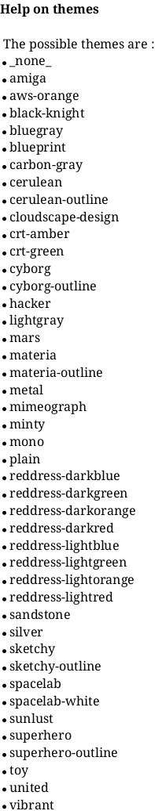
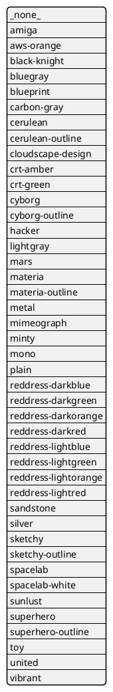
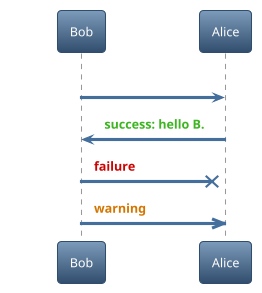

## Themes

Following the work from [Brett Schwarz](https://github.com/bschwarz/puml-themes), we have integrated several themes into [the main core library](https://github.com/plantuml/plantuml/tree/master/themes).

Since those themes are included into the library, it is working out of the box: you don't need to install anything on your side.
You just have to use the ``!theme`` directive:






## List of available themes

Several websites are listing available themes:

* [Gallery of all official PlantUML themes](https://the-lum.github.io/puml-themes-gallery/).
* [Examples of some Puml Themes](https://bschwarz.github.io/puml-themes) made by [Brett Schwarz](https://github.com/bschwarz/puml-themes) on [the Theme Gallery](https://bschwarz.github.io/puml-themes/gallery.html).


Finally, you can list all available themes from your PlantUML library:



Or you can use the [``%get_all_theme`` builtin function](preprocessing#51658407adfab1b3) to retreive a JSON array of all PlantUML theme.



_Available from version 1.2024.4._


## Coloring message with some procedures included on some theme

Some theme includes some procedures, to help coloring message, as:
* `$success("<msg>")`
* `$failure("<msg>")`
* `$warning("<msg>")`

Example:




## Local themes

You can create your own theme on your local file system. You can [duplicate any existing theme](https://github.com/plantuml/plantuml/tree/master/themes) to create your own one.

By default, a theme file is named ``puml-theme-foo.puml`` where ``foo`` is the name of the theme.

To invoke a local theme, you have to use the following directive:

```
!theme foo from /path/to/themes/folder
```


## Themes from the Internet

Other repositories can also publish themes for PlantUML.

Theme files must follow the same convention: ``puml-theme-foo.puml`` where ``foo`` is the name of the theme.

To use a theme from a remote repository, you have to use the following directive:

```
!theme amiga from https://raw.githubusercontent.com/plantuml/plantuml/master/themes
```

If you find any interesting theme, you can also propose a pull request so that we integrate this theme into [the main core library](https://github.com/plantuml/plantuml/tree/master/themes).


