## Work Breakdown Structure (WBS)

A [Work Breakdown Structure (WBS) diagram](https://en.wikipedia.org/wiki/Work_breakdown_structure) is a key **project management tool** that breaks down a project into smaller, more **manageable components** or tasks. It's essentially a **hierarchical decomposition** of the total scope of work to be carried out by the project team to accomplish the project objectives and create the required deliverables.

**PlantUML** can be particularly useful for creating **WBS diagrams**. Its **text-based diagramming** means that creating and updating a WBS is as straightforward as editing a text document, which is especially beneficial for managing changes over the project's lifecycle. This approach allows for easy integration with **version control systems**, ensuring that all changes are tracked and the history of the WBS evolution is maintained.

Moreover, PlantUML's compatibility with various other tools enhances its utility in **collaborative environments**. Teams can easily integrate their WBS diagrams into broader project documentation and management systems. The simplicity of PlantUML's syntax allows for quick adjustments, which is crucial in **dynamic project environments** where the scope and tasks may frequently change. Therefore, using PlantUML for WBS diagrams combines the clarity of **visual breakdown** with the agility and control of a **text-based system**, making it a valuable asset in **efficient project management**.

## OrgMode syntax

This syntax is compatible with OrgMode

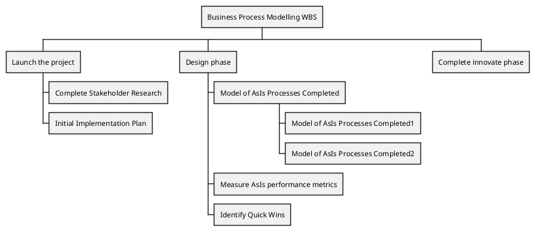

## Change direction

You can change direction using ``<`` and ``>``

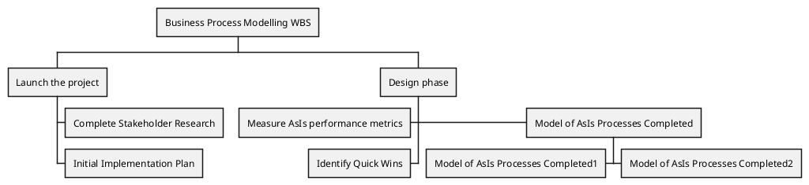

## Arithmetic notation

You can use the following notation to choose diagram side.

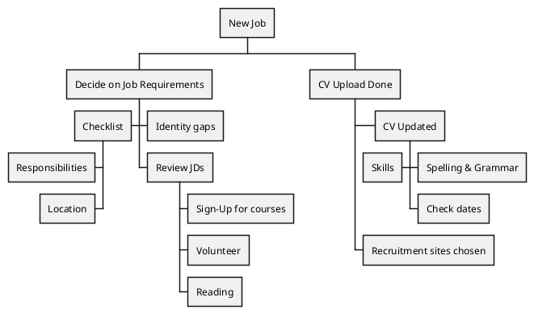

## Multilines

You can use ``:`` and ``;`` to have multilines box, as on [MindMap](mindmap-diagram#4ea2ymh57pwsk99qth2e).

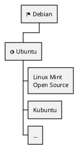

*[Ref. [QA-13945](https://forum.plantuml.net/13945)]*

## Removing box

You can use underscore ``_`` to remove box drawing.

### Boxless on Arithmetic notation
#### Several boxless node
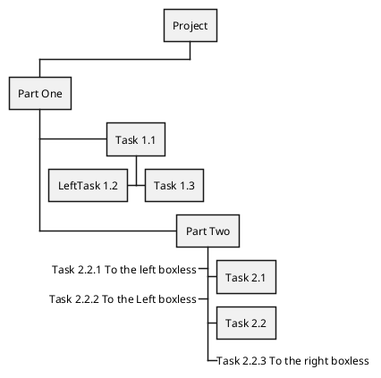
#### All boxless node
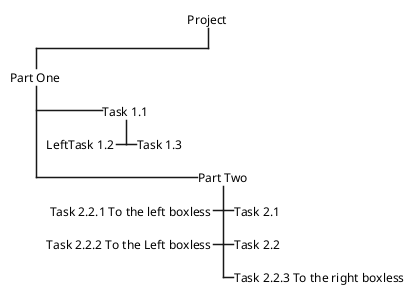

### Boxless on OrgMode syntax
#### Several boxless node
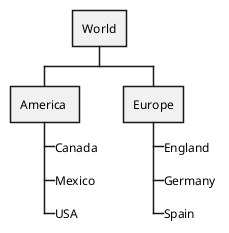
*[Ref. [QA-13297](https://forum.plantuml.net/13297)]*

#### All boxless node
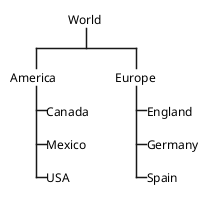
*[Ref. [QA-13355](https://forum.plantuml.net/13355)]*

## Colors (with inline or style color)

It is possible to change node [color](color):

* with inline color
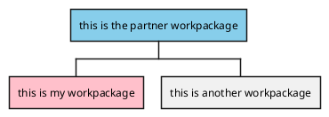

*[Ref. [QA-12374](https://forum.plantuml.net/12374), only from v1.2020.20]*

* with style color
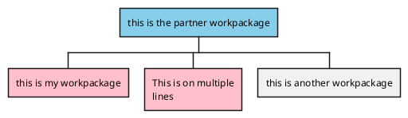

## Using style

It is possible to change diagram style.

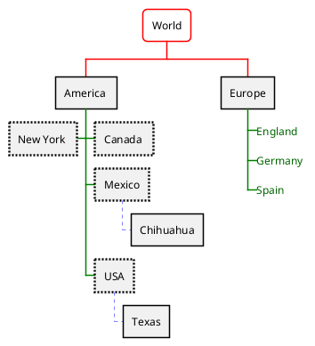

## Word Wrap

Using ``MaximumWidth`` setting you can control automatic word wrap. Unit used is pixel.

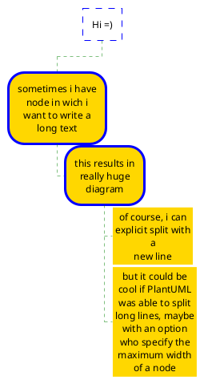

## Add arrows between WBS elements

You can add arrows between WBS elements.

Using alias with `as`:
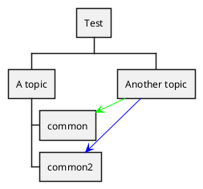

Using alias in parentheses:
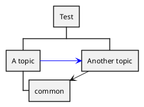

*[Ref. [QA-16251](https://forum.plantuml.net/16251/link-between-objet-in-wbs)]*

## Creole on WBS diagram

You can use [Creole or HTML Creole](creole) on WBS:

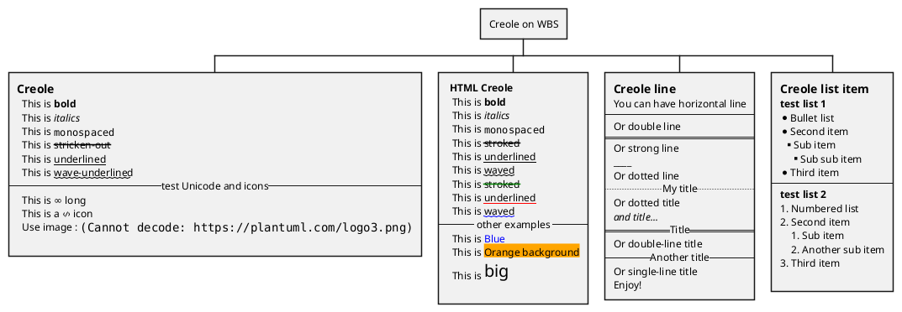

