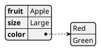
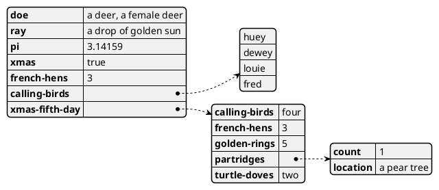
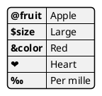
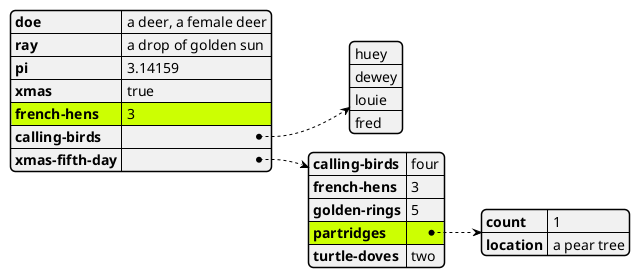
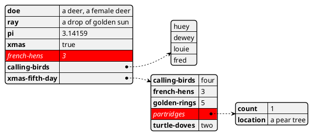
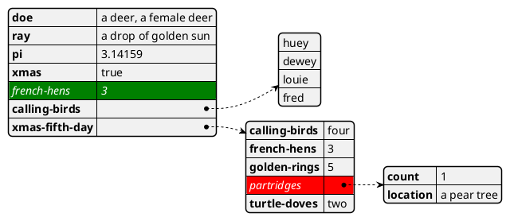
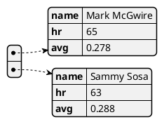
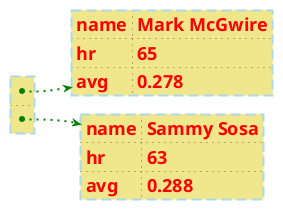
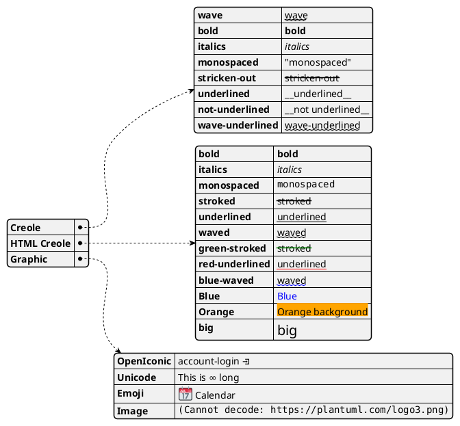

## Display YAML Data

[YAML](https://en.wikipedia.org/wiki/YAML) format is widely used in software.

You can use PlantUML to visualize your data.

To activate this feature, the diagram must:
* begin with ``@startyaml`` keyword
* end with ``@endyaml`` keyword. 

## Complex example

## Specific key (with symbols or unicode)

*[Ref. [QA-13376](https://forum.plantuml.net/13376/)]*

## Highlight parts

### Normal style

### Customised style 

*[Ref. [QA-13288](https://forum.plantuml.net/13288/the-ability-to-customise-the-highlight-for-json-yaml?show=13378#c13378)]*

## Using different styles for highlight 

It is possible to have different styles for different highlights.

*[Ref. [QA-15756](https://forum.plantuml.net/15756/yaml-multiple-highlight-defs), [GH-1393](https://github.com/plantuml/plantuml/issues/1393)]*

## Using (global) style

### Without style *(by default)*

### With style

You can use [style](style-evolution) to change rendering of elements.

*[Ref. [QA-13123](https://forum.plantuml.net/13123)]*

## Creole on YAML

You can use [Creole or HTML Creole](creole) on YAML diagram:

